## Lecturers {.smaller}

::: columns
::: {.column width="30%"}
{.absolute top="20%" left="7%" style="display: inline-block; width: 150px; height: 150px;border-radius:50%;"}

{.absolute top="55%" left="7%" style="display: inline-block; width: 150px; height: 150px;border-radius:50%;"}
:::

::: {.column width="70%" .iconlist}
::: {.absolute top="120"}
-  &nbsp; 
-  &nbsp; []()
-  &nbsp; 
-  &nbsp; [](https://www.github.com/)

<div><br></div>

-  &nbsp; 
-  &nbsp; []()
-  &nbsp; 
-  &nbsp; [](https://www.github.com/)

:::
:::
:::

## About this course {.medium}

::: {.secfont style="font-size:2.3rem;text-align:center;"}
"A picture is worth a thousand words"
:::

This course approaches monetary policy by analyzing data and creating data visualizations. We study selected illustrations, discuss the underlying data, the theoretical background and policy implications. We will assemble plots in class and study the basics of data visualization.

You will gain:

- an overview of [economic issues in monetary policy]{.marker-hl} 
- a basic understanding of [principles of data visualization]{.marker-hl}
- knowledge how to [enrich academic publications]{.marker-hl} with informative graphs

## Collaboration with OeNB {.medium}

This course is a collaboration with the [Austrian National Bank](https://www.oenb.at) (OeNB). The bank will exclusively provide datasets for this class to create data visualizations. 

\

{fig-align="center" height="90px"}

There will be an [award ceremony]{.marker-hl} at the end of the course where the best visualizations will be presented at the OeNB.

## Who are you?

{.absolute bottom="0%" left="0%" height="400px"}
{.absolute bottom="0%" left="15%" height="400px"}
{.absolute bottom="0%" left="33%" height="400px"}
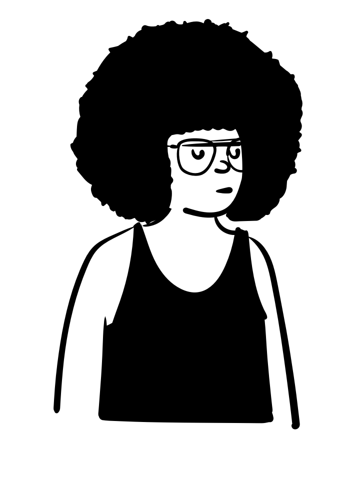{.absolute bottom="0%" left="50%" height="400px"}

[What do you expect of this course? Do you already have some coding experience in R?]{.bubble .bubble-bottom-right .absolute top="15%" right="0%" style="max-width:400px;--bubcol: var(--bubcol-dred); font-size:1.8rem;"}

## Schedule

```{r packages}
#| include: false
library(tidyverse)
library(readxl)
library(glue)
library(gt)

Sys.setlocale(locale="en_US.UTF-8")
schedule <- read_xlsx("../../data/schedule/schedule.xlsx")
```

```{r table}
#| echo: false
#| results: 'asis'
library(gtExtras)
schedule |> arrange(Date) |> select(-c(Chart,Slides,Code,Data)) |>
  mutate(Assignment = ifelse(!is.na(Assignment), "pen", "circle-xmark"), 
        Date = format(Date, '%b %d, %Y')) |>
        gt() |> 
        fmt_icon(Assignment, height = "1em", fill_color = c("pen" = "black", "circle-xmark" = "#bdbebd")) |> 
        opt_table_font(font = google_font("Roboto Slab")) |>
        tab_options(
              column_labels.font.size = "20px",
              column_labels.font.weight = "bold"
          ) |>
        tab_style(location = cells_body(),
                  style = cell_text(weight = 200)) |>
        fmt_index(columns = Content, pattern = "{x}.") |>
        cols_width(1:3 ~pct(12),
                    4 ~ pct(30),
                    5 ~ pct(14)) |>
        cols_align(align = "left") |>
        cols_align(align = "center", columns = 5) |>
        as_raw_html(inline_css = FALSE) 
```

## Assignments {.medium}

Assignment 1 provides the setup of the R infrastructure that is required in this course. There are no points for this assignment. 

Assignments 2 to 4 are recreations of examplary figures. These examples are related to figures that are discussed in class. Students should then try to [reproduce the plots at home]{.marker-hl} and improve their individual coding skills. 

The raw data for the figures are available as CSV files. The charts should then be uploaded to [Canvas](https://canvas.wu.ac.at) [**before 9 a.m.**]{.marker-hl} on the day of the deadline.

## Assignments {.medium}

::: {.r-stack}

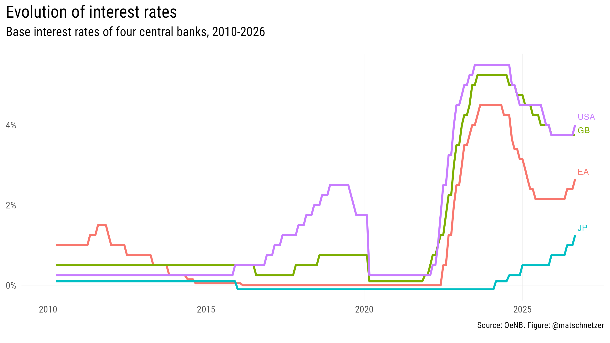{.fragment .fade-up width="800"} 

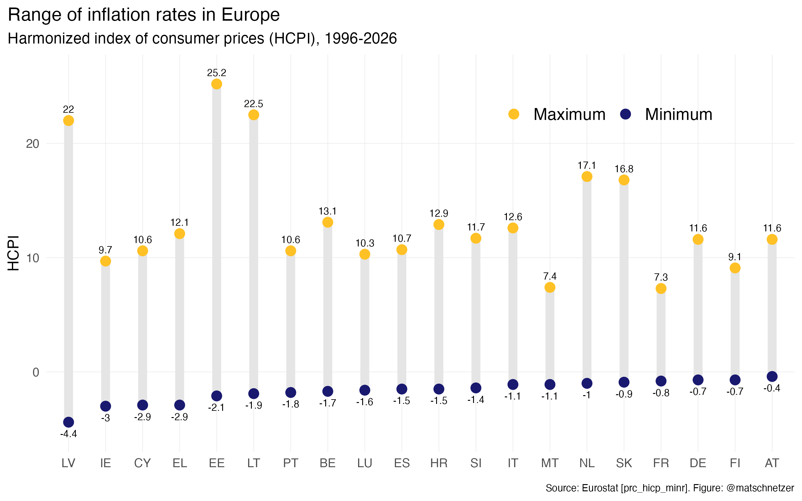{.fragment .fade-up width="800"}

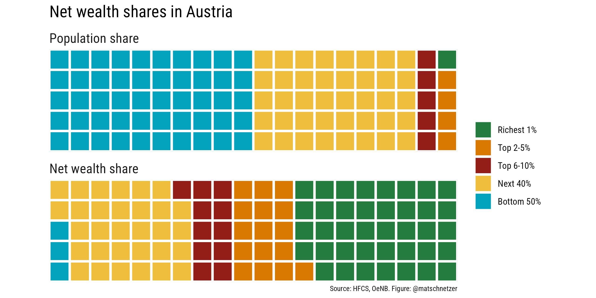{.fragment .fade-up width="1000"}

:::


## Chart & Report {.smaller}

::: columns
::: {.column width="50%"}
### Chart presentation
::: {.altlist}
- Research question
- Data
- Chart 
- Conclusion
:::
[**Deadline: January 11, 2027**]{.marker-hl}
:::

::: {.column width="50%"}
### RMarkdown (or Quarto) Report
::: {.altlist}
- Title 
- Author 
- Introduction
- Research question
- Data
- Result
- Conclusion
- Code
:::
[**Deadline: January 31, 2027**]{.marker-hl}
:::
:::


## Grading {.medium}

<br>
<i class="fa-solid fa-home icon"></i> Assignments: 30\% [(0-10 points for each visualization)]{.grey600 style="font-size:1.5rem;"}
<br>
<br>

. . .

<i class="fa-solid fa-person-chalkboard icon"></i>  Chart presentation: 30\% [(0-20 points for the quality of the presentation, 0-10 for the preliminary chart)]{.grey600 style="font-size:1.5rem;"} 
<br>
<br>

. . .

<i class="fa-solid fa-file-pen icon"></i> Written report: 40\% [(0-40 points for the report and the final chart)]{.grey600 style="font-size:1.5rem;"}


::: aside
::: { style="font-size:1.5rem" }
 &nbsp; 100-90: Excellent &emsp;
 &nbsp; 89-80: Good &emsp;
 &nbsp; 79-65: Satisfactory &emsp;
 &nbsp; 64-50: Sufficient <br>
[All single tasks have to be passed]{.marker-hl} (50% threshold each).
:::
:::

## Visualizations by students {.smaller}

::: {style="display: grid; grid-template-columns: repeat(auto-fill, minmax(300px, 1fr));grid-gap: 1em;"}

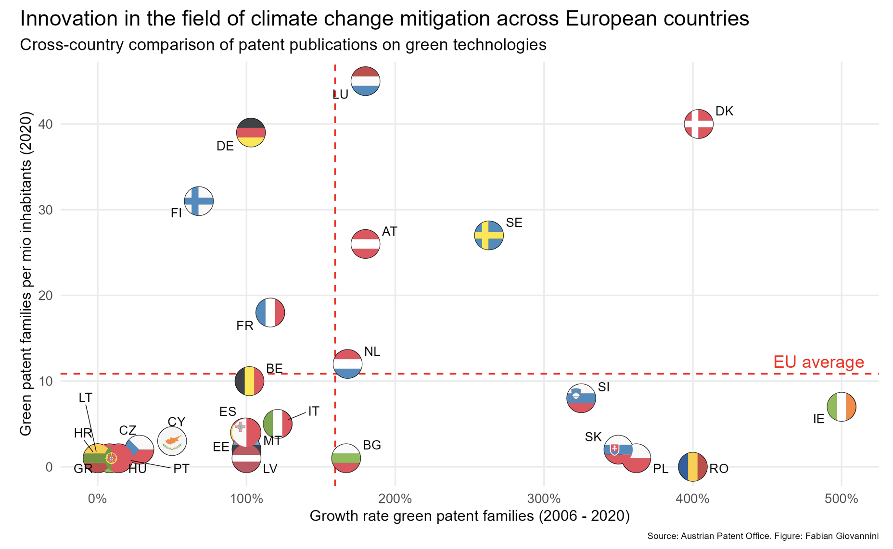{group="my-gallery"}

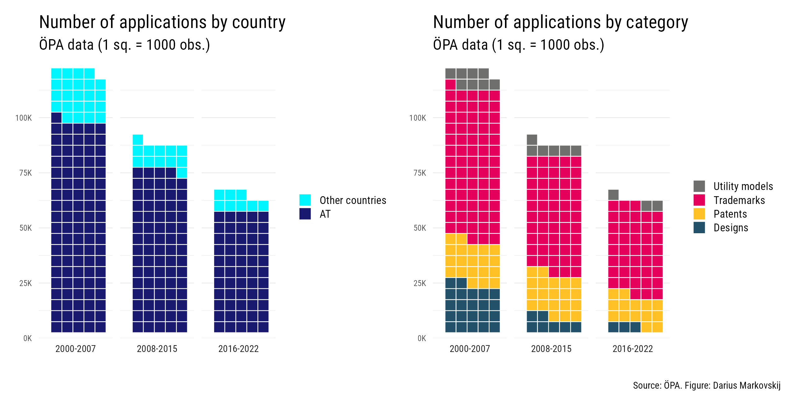{group="my-gallery"}

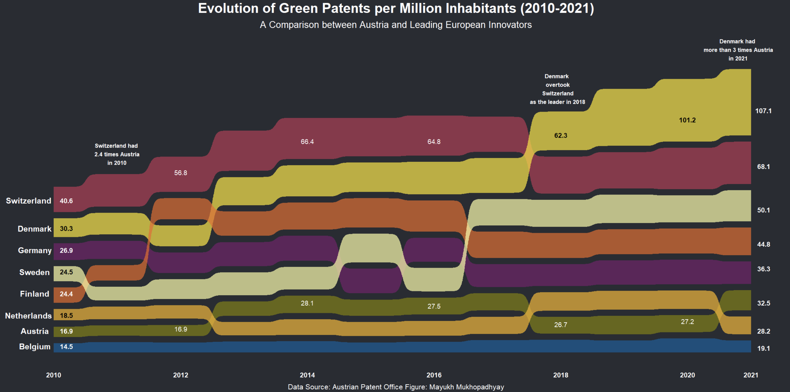{group="my-gallery"}

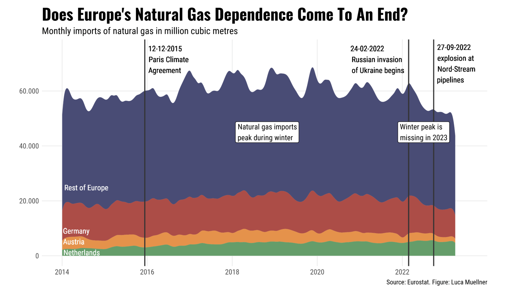{group="my-gallery"}

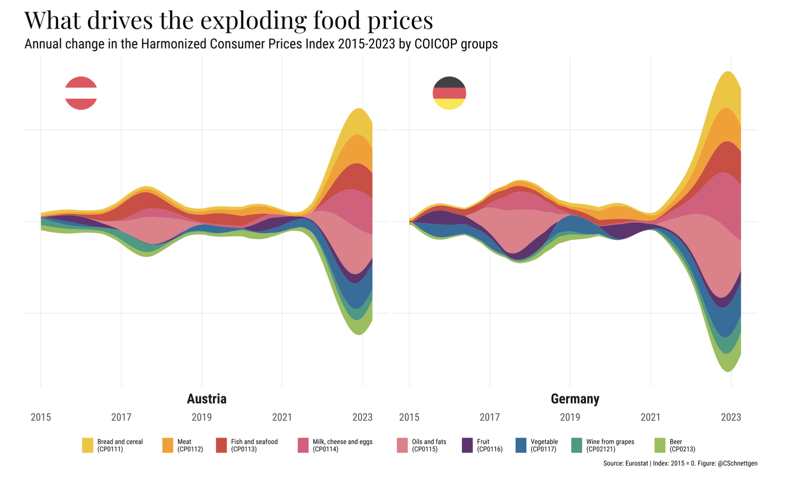{group="my-gallery"}

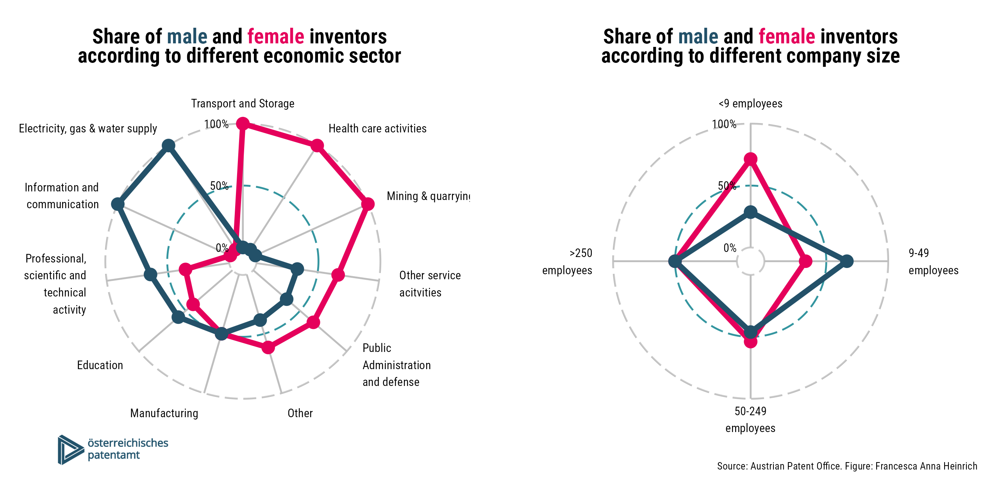{group="my-gallery"}

:::

## Feedback, cooperation and help {.smaller}

Let us know your [feedback]{.marker-hl} on the course anytime. If possible, we will try to incorporate your feedback immediately. At least, we will consider it for future courses. 

As some of you might already have advanced coding skills in R, please support each other and collaborate. This does not mean that one person does all the coding and shares with all colleagues. Students should have an intrinsic motivation to improve their coding skills but [cooperate to learn from each other]{.marker-hl}. 

Please also consult support platforms like [Stack Overflow](https://stackoverflow.com) or take a look at the cheatsheets:

::: {style="text-align:center;"}
[{width=140}](https://posit.co/wp-content/uploads/2022/10/tidyr.pdf) [{width=140}](https://posit.co/wp-content/uploads/2022/10/data-transformation-1.pdf) [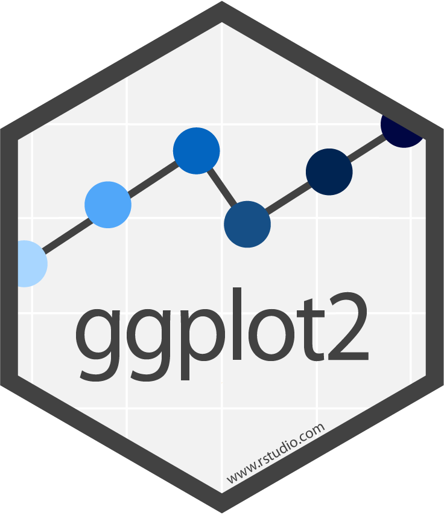{width=140}](https://posit.co/wp-content/uploads/2022/10/data-visualization-1.pdf) [{width=140}](https://posit.co/wp-content/uploads/2022/10/rmarkdown-1.pdf)
:::

## Recommended Literature

::: {.tbl-larger .recommended-lit}
|   |   |
|---|---|
| 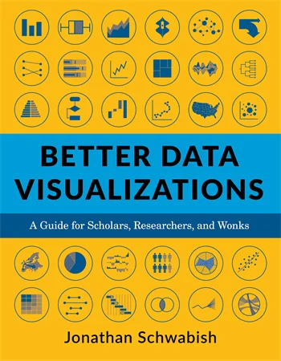 | **Jonathan Schwabish** <br> *Better Data Visualizations: A Guide for Scholars, Researchers, and Wonks* <br> Columbia University Press <br> ISBN-13: 9780231193115 |
| 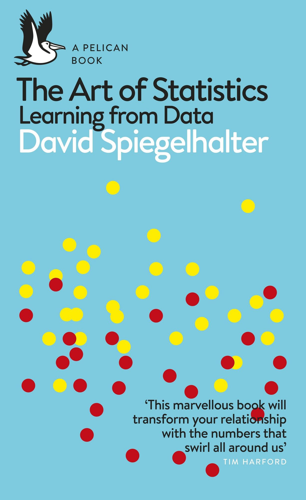 | **David Spiegelhalter** <br> *The Art of Statistics: Learning from Data* <br> Penguin Books UK <br> ISBN-13: 9780241258767 |
: {tbl-colwidths="[20,80]"}
:::


# Empirical Monetary Policy Research

<center>
{height=350}
</center>

::: footer
:::


## The era of evidence in economics {.smaller}

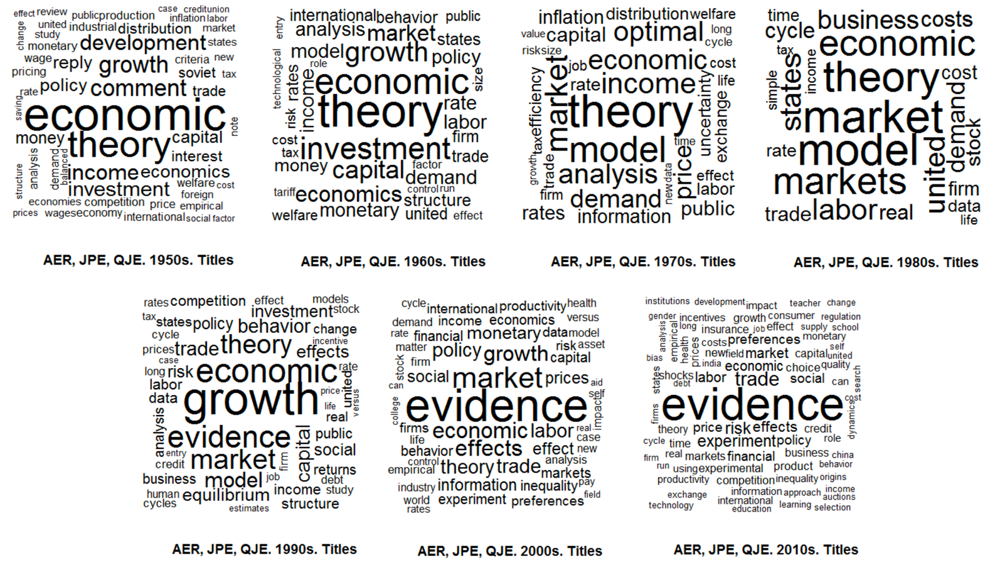{fig-align="center" height="390"}

::: {style="font-size:1.5rem;font-weight:100;" .secfont}
The figure shows the evolution of economics literature by text mining the 500 most-cited titles in top journals by decade. There is a shift from advancing theory towards [empirical evidence]{.hl .hl-dred}.
:::

::: {.aside}
Source: @brice:2019
:::

## The rise of empirical articles {.smaller}

::: {.tbl-larger .recommended-lit}
|   |   |
|---|---|
|  | There is a distinct [rise of empirical papers]{.hl .hl-dred} in economics. In the 1980s, around one third of publications was empirical. Today, it's more than half. This trend is present in all sub-fields of the discipline (labor, finance, macro, etc.). <br><br> The analyis is based on 134,892 papers published in 80 journals between 1980 and 2015. Papers are labeled as empirical if they use data to estimate economically meaningful parameters. |
: {tbl-colwidths="[50,50]"}
:::

::: {.aside}
Source: @angrist:2017
:::

## Evidence-based economic policy {.smaller}

::: {.incremental}
- [Data collection:]{.secfont .hl .hl-blue} Collection of relevant and high-quality data (administrative data, surveys, interviews, observations, etc.). Researchers should be aware of the qualities but also of the flaws of the data.
- [Data analysis:]{.secfont .hl .hl-blue} The design and type of analysis depends on the question being asked and resources available. The methods range from qualitative to quantitative analysis. The choice of application might unwittingly involve normative reflections by the researcher.
- [Policy suggestions:]{.secfont .hl .hl-blue} A major goal of empirical economics is to serve and improve policy making. The findings should, however, be carefully interpreted with regard to the limitations of empirical analyis. Economic policy, even if it's evidence-based, is affected by norms, beliefs, etc.
:::

# Mind the (data) gap!

<center>
{height=350}
</center>

::: footer
:::

## The limits of data {.medium}

::: {.columns}
::: {.column width=30%}
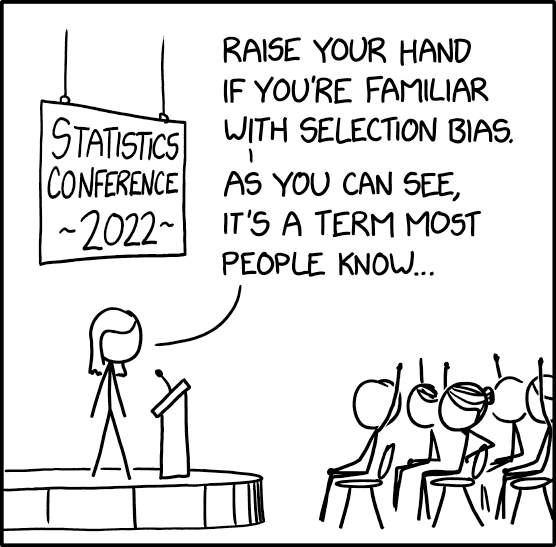
:::
::: {.column width=70%}
- Data is never a perfect reflection of the world!
- It's only a subset: not crime but [reported]{.hl .hl-dred} crime
- Information is collected by humans and processed by machines: imprecisions and errors are [inevitable]{.hl .hl-blue}!
- Be aware of potential (cognitive and statistical) biases!
:::
:::

::: {.aside}
Source: [XKCD](https://xkcd.com/2618/)
:::

## Invisible women

::: {.tbl-larger .recommended-lit}
|   |   |
|---|---|
|  | **Caroline Criado Perez** <br> *Exposing Data Bias in a World Designed for Men* <br> Random House Uk <br> ISBN: 978-1-78470-628-9 <br><br> The world we live in is built around male data, preferences, and assumptions. There are numerous examples of how the [gender data gap]{.hl .hl-dred} has led to women being overlooked and undervalued in areas ranging from medicine to urban planning. To create a more just and equal society, we need to take into account the different experiences and needs of women and other marginalized groups in our data collection and decision-making processes. |
: {tbl-colwidths="[20,80]"}
:::

## Invisible rich {.smaller}

::: {.tbl-larger .recommended-lit}
|   |   |
|---|---|
| 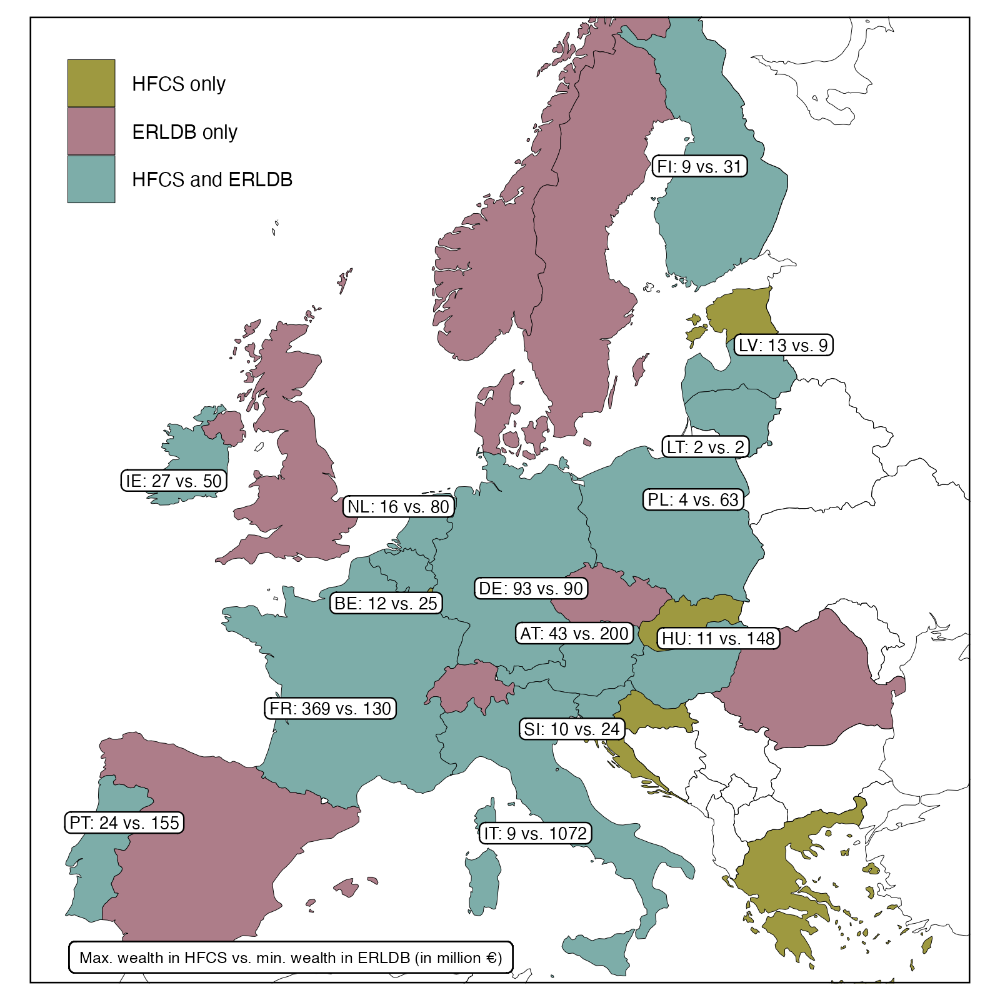 | Survey data are based on representative samples drawn from total population. However, the probability of drawing one of the few very rich households into the sample is infinitesimal. Moreover, participation in surveys is mostly voluntary and there is a higher refusal rate at the top. This [poor coverage of the top]{.hl .hl-dred} in wealth and income surveys conceals the extent of inequality. <br><br> The figure shows the gap between the richest observation in wealth survey data (HFCS) and the "poorest" observation in national rich lists created by magazines. |
: {tbl-colwidths="[50,50]"}
:::

::: {.aside}
Source: @disslbacher:2020
:::

## Administrative versus survey data {.smaller}

::: {.absolute top="10%" left="0"}

:::

::: {.absolute top="30%" left="27%" .textbox .fragment .fade-up .altlist}
### Impact on response behavior:

- Social desirability
- Sociodemographic characteristics
- Survey design
- Learning effect
:::

::: aside
Source: @angel:2019
:::

## Mean reverting errors {.smaller}

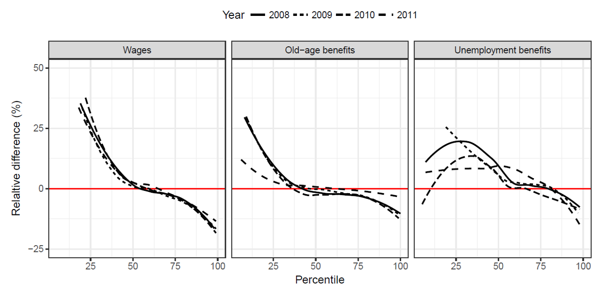

::: aside
Source: @angel:2019
:::

## How do we explain the mismatch? {.smaller}

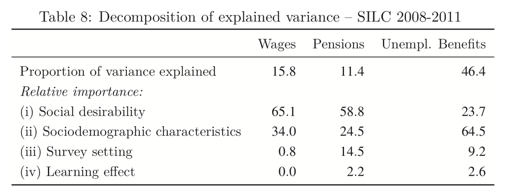

::: aside
Source: @angel:2019
:::

# Why should we plot data?

<center>
{height=350}
</center>

::: footer
:::


## Anscombe's quartet

```{r anscomedata}
#| echo: false
library(kableExtra)
library(datasauRus)
anscombe_m <- data.frame()

for(i in 1:4) {
  anscombe_m <- rbind(anscombe_m, data.frame(x=anscombe[,i], y=anscombe[,i+4]))}
  
anscombe_m <- anscombe_m |> 
  mutate(set = c(rep("I",11),rep("II",11),rep("III",11),rep("IV",11)))

means <- anscombe |> 
  select(x1,y1,x2,y2,x3,y3,x4,y4) |> 
  summarise(across(everything(), mean))

sd <- anscombe |> 
  select(x1,y1,x2,y2,x3,y3,x4,y4) |> 
  summarise(across(everything(), sd))

cor <- anscombe |>
  summarise(x1=cor(x1,y1), x2=cor(x2,y2), x3=cor(x3,y3), x4=cor(x4,y4))

anscombe |> 
  mutate(obs = as.character(1:n())) |> 
  select(obs,x1,y1,x2,y2,x3,y3,x4,y4) |>
  add_row(obs="Mean",round(means,2)) |>
  add_row(obs="SD",round(sd,2)) |>
  add_row(obs="Corr",round(cor,2)) |>
  kbl(escape = FALSE, col.names = c("Obs.", rep(c("X","Y"),4)), align="rcccccccc") |>
  column_spec(1, border_right = T, bold = T) |>
  column_spec(seq(3,7,2), border_right = T) |>
  row_spec(11, extra_css = "border-bottom: 3px solid") |>
  add_header_above(c(" " = 1, "I" = 2, "II"=2, "III"=2, "IV"=2)) |>
  kable_classic(full_width = F)
```


## What do we learn when plotting the data?

```{r anscombe}
#| echo: false
ggplot(anscombe_m, aes(x, y)) +  
geom_text(aes(x = 15, y = 5, label=set), family = "Alfa Slab One", size=36, color = "gray95") + 
geom_smooth(method="lm", fill=NA, fullrange=TRUE, color = "black", linewidth=0.5) + 
geom_point(size=3.5, color="black", fill="red", alpha=0.8, shape=21) +
facet_wrap(~set, ncol=2, scales = "free") +
scale_x_continuous(limits = c(0,20)) +
scale_y_continuous(limits = c(0,15)) +
labs(x = NULL, y = NULL) +
coord_cartesian(expand = F) +
theme_minimal() +
theme(strip.text = element_blank(),
axis.text = element_blank(),
panel.border = element_rect(linewidth = 0.1, fill = NA))
```

## Do you see correlation?

```{r datasaurus}
#| echo: false
#| fig-align: center
datasaurus_dozen |>
  filter(dataset %in% c("slant_down", "dino")) |>
  mutate(dataset = ifelse(dataset == "dino", "B", "A")) |>
  ggplot(aes(x = x, y = y, colour = dataset))+
  geom_point() +
  scale_color_manual(values = c("#C32402", "#0234C3")) +
  facet_wrap(~dataset, ncol = 2) +
  labs(x=NULL, y=NULL) +
  theme_minimal() +
  theme(legend.position = "none",
  strip.text = element_blank(),
  panel.border = element_rect(linewidth = 0.1, fill = NA))
```

. . .

::: {.columns}
::: {.column style="text-align:center;"}
[Correlation: -0.07]{.secfont style="font-size:1.5rem;color:#C32402;"}
:::
::: {.column style="text-align:center;"}
[Correlation: -0.07]{.secfont style="font-size:1.5rem;color:#0234C3;"}
:::
:::


## Same same but different

```{r dinolpots}
#| echo: false
#| fig-align: center
datasaurus_dozen |>
  filter(!dataset == "dino") |>
  ggplot(aes(x = x, y = y, colour = dataset))+
  geom_point() +
  geom_text(aes(x = 50, y = -10, label = glue::glue("Cor.: {round(cor(x,y),2)}")), hjust = 0.5) +
  facet_wrap(~dataset, nrow = 2) +
  labs(x=NULL, y=NULL) +
  theme_minimal() +
  theme(legend.position = "none",
  strip.text = element_blank(),
  axis.text = element_blank(),
  panel.border = element_rect(linewidth = 0.1, fill = NA))
```


## Bibliography {.bibstyle}

:::footer
:::