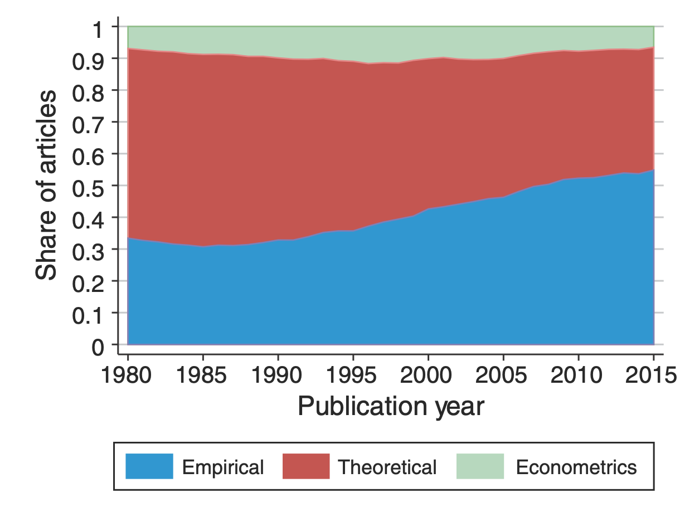
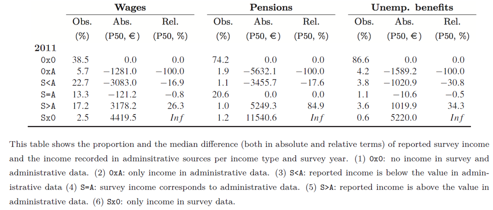

## What is money? {.medium}

Money is often introduced in textbooks as a neutral technical device that solves the inefficiencies of barter — a "medium of exchange" that emerged spontaneously to avoid the problem of a *double coincidence of wants*.

A (Post-)Keynesian perspective instead treats money as a social and credit relation: money is fundamentally a unit of account for debt, and most money in modern economies exists as [IOUs]{.marker-hl} — promises to pay, recorded on balance sheets.

::: {.fragment}
This distinction matters enormously for how we think about *who creates money*, *what limits its creation*, and *what central banks can and cannot do*.
:::

## Functions of money {.medium}

::: {.altlist}
- **Unit of account** — the measure in which prices, debts and contracts are denominated
- **Medium of exchange** — used to settle transactions
- **Store of value** — a way to hold wealth over time
- **Means of final settlement of debt** — this is the function (Post-)Keynesians emphasize
:::

. . .

For (Post-)Keynesians, money is above all a way of settling debt obligations in a [monetary production economy]{.marker-hl}: firms borrow to produce before they sell, and money bridges this gap between outlays and receipts (Keynes' *finance motive*).

## Two views on the origin of money {.medium}

::: columns
::: {.column width="50%"}
### Neoclassical / mainstream

- Money emerged to overcome the inefficiencies of **barter**
- Historically and logically [commodity-based]{.marker-hl} (gold, silver)
- Government and banks essentially replace the commodity with tokens of equal value
:::

::: {.column width="50%"}
### (Post-)Keynesian

- Historical and anthropological evidence finds [little support for a barter origin]{.marker-hl}
- Money originates in [credit and debt relations]{.marker-hl}, often tied to tax obligations to the state (chartalism)
- Money is a [social institution]{.marker-hl}, not a commodity
:::
:::

## How is money created? {.medium}

Most money in modern economies is not created by central banks printing currency, but by [commercial banks]{.marker-hl} when they extend credit.

::: {.secfont style="font-size:2rem;text-align:center;"}
"Loans create deposits" 
:::

When a bank grants a loan, it simultaneously creates a matching deposit on the borrower's account — a balance sheet expansion, not a transfer of pre-existing funds.

. . .

This is the principle of [endogenous money]{.marker-hl}: the money supply expands and contracts with the demand for credit in the economy, rather than being fixed exogenously by the central bank.

## The role of banks {.medium}

::: {.altlist}
- Commercial banks do not simply act as [intermediaries]{.marker-hl} that lend out pre-existing deposits from savers to borrowers
- Instead, they [create purchasing power]{.marker-hl} "out of nothing" when granting a loan, subject to profitability considerations and regulatory constraints (capital and liquidity requirements)
- Reserves at the central bank are needed for [interbank settlement]{.marker-hl}, not as a precondition for lending
:::

. . .

This overturns the textbook "money multiplier" story, in which the central bank sets the monetary base and banks mechanically multiply it into a fixed volume of loans.

## Neoclassical view: the money multiplier {.medium}

1. The central bank sets the quantity of [bank reserves]{.marker-hl} (the monetary base)
2. Banks lend out a fraction of these reserves and deposits, subject to a reserve requirement
3. The money supply is a stable multiple of the monetary base: $$M = m \times B$$
4. Money is [exogenous]{.marker-hl}: it is a stock controlled directly by the central bank

. . .

Implication: controlling the growth of the money supply (monetarism) is seen as the key lever to control inflation.

## (Post-)Keynesian view: endogenous money {.medium}

1. Loan demand from firms and households [drives credit creation]{.marker-hl} by commercial banks
2. Central banks do not fix the quantity of reserves; they accommodate banks' demand for reserves at a chosen [policy interest rate]{.marker-hl}
3. Causation runs from [loans to deposits to reserves]{.marker-hl} — the reverse of the multiplier story
4. Money is [endogenous]{.marker-hl}: its quantity adjusts to the needs of economic activity

. . .

This is often called the [horizontalist]{.marker-hl} view — central banks set the price of reserves (the interest rate) and supply whatever quantity of reserves banks need at that rate.

## The role of central banks {.medium}

::: {.altlist}
- Central banks act as the [lender of last resort]{.marker-hl} to the banking system, ensuring liquidity and settlement of interbank payments
- Modern central banks primarily operate by setting a short-term [policy interest rate]{.marker-hl} rather than a fixed money supply target
- They influence economic activity indirectly, through the [cost of credit]{.marker-hl}, exchange rates and expectations
- Quantitative easing (QE) expands central bank reserves and asset holdings, but does not mechanically translate into a proportional expansion of bank lending
:::

## Key differences at a glance {.smaller}

| Question | Neoclassical / mainstream | (Post-)Keynesian |
|---|---|---|
| What is money? | Evolved from barter, ultimately commodity-based | A social/credit relation, unit of account for debt |
| How is money created? | Central bank controls the monetary base; multiplier | Banks create money endogenously via loans |
| Money supply | Exogenous, set by the central bank | Endogenous, demand-determined |
| Central bank tool | Controls quantity of money/reserves | Sets the price (interest rate) of reserves |
| Inflation | "Always and everywhere a monetary phenomenon" (quantity theory) | Driven by costs, distributional conflict, demand pressures |
| Saving & investment | Saving [enables]{.marker-hl} investment (loanable funds) | Investment [generates]{.marker-hl} the saving needed to finance it |

## Why this matters for monetary policy {.medium}

These theoretical differences are not merely academic — they shape how economists interpret real-world policy:

::: {.altlist}
- Whether **quantitative easing** should be expected to be inflationary
- Whether **interest rate hikes** are the appropriate tool against all types of inflation
- Whether **fiscal deficits** are inherently constrained by "crowding out" of private investment
- How **financial instability** and banking crises originate endogenously in credit cycles
:::

. . .

Over the course we will use [data and visualizations]{.marker-hl} to examine these questions empirically — e.g. by tracing central bank balance sheets, bank lending, and monetary aggregates over time.

## What is a monetary regime? {.medium}

A [monetary regime]{.marker-hl} is the set of institutional rules that govern how money is created, valued and exchanged — both domestically (what anchors the value of money) and internationally (how a currency relates to other currencies).

Key dimensions of a monetary regime:

::: {.altlist}
- What (if anything) backs or anchors the currency's value
- How exchange rates with other currencies are determined
- How much discretion the central bank has over monetary policy
- What nominal target, if any, policy is oriented towards (money supply, exchange rate, inflation rate)
:::

## The gold standard {.medium}

Under the classical gold standard (roughly 1870s–1914), currencies were pegged to a fixed quantity of gold and freely convertible.

::: {.altlist}
- Exchange rates between countries were effectively [fixed]{.marker-hl}
- Balance-of-payments adjustment worked through gold flows and the "price-specie-flow mechanism": deficit countries lost gold, contracting money supply, prices and demand, restoring balance
- Domestic monetary policy was largely [subordinated]{.marker-hl} to maintaining convertibility
:::

. . .

Critique: this mechanism imposed painful deflation and unemployment on deficit countries — a recurring (Post-)Keynesian concern about "external constraints" on domestic policy autonomy.

## Bretton Woods (1944–1971) {.medium}

::: {.altlist}
- Currencies pegged to the US dollar, which was itself convertible into gold at a fixed rate
- Adjustable pegs allowed for occasional realignments, unlike the rigid gold standard
- Capital controls gave countries more room for [independent domestic policy]{.marker-hl} (full employment, growth) — closer to the Keynesian vision at its founding (Keynes was a key architect)
- Collapsed in 1971 when the US suspended dollar–gold convertibility
:::

## From fixed to floating exchange rates {.medium}

Since the 1970s, most major currencies float against each other, with values determined by supply and demand in foreign exchange markets rather than by a fixed peg.

::: {.fragment}
This raises the classic **"impossible trinity" / trilemma**: a country cannot simultaneously have
:::

::: {.altlist}
- A fixed exchange rate
- Free international capital mobility
- An independent monetary policy
:::

::: {.fragment}
— it can choose at most two of the three.
:::

## Monetarism and money supply targeting {.medium}

In the 1970s–80s, several central banks (e.g. the Bundesbank, the Fed under Volcker) explicitly targeted the [growth rate of the money supply]{.marker-hl}, following the monetarist prescription that controlling money growth controls inflation.

. . .

In practice, this proved difficult: the relationship between measured monetary aggregates and inflation was unstable, partly because — as the endogenous money view predicts — the money supply responds to economic activity rather than being a lever fully under the central bank's control. Most central banks abandoned strict money-supply targets by the 1990s.

## Inflation targeting {.medium}

Since the 1990s, the dominant regime among major central banks (ECB, Fed, Bank of England, ...) has been [inflation targeting]{.marker-hl}:

::: {.altlist}
- An explicit numerical inflation target (commonly around 2%)
- The [policy interest rate]{.marker-hl} is the main instrument, adjusted in response to the outlook for inflation and economic activity
- Central banks are typically granted formal [independence]{.marker-hl} from elected governments to pursue this target
- Communication and credibility ("forward guidance") become central tools alongside the interest rate itself
:::

## Monetary regimes: a comparative view {.smaller}

| Regime | Anchor | Exchange rate | Policy autonomy |
|---|---|---|---|
| Gold standard | Gold | Fixed | Very limited |
| Bretton Woods | US dollar / gold | Fixed but adjustable | Moderate (with capital controls) |
| Monetarist money targeting | Money supply growth | Floating | Rule-based, limited discretion |
| Inflation targeting | Inflation rate | Mostly floating | Discretionary, but rule-guided |
| Currency union (e.g. euro area) | Common currency, single central bank | Fixed *within* the union | None for individual members |

. . .

(Post-)Keynesians stress that the choice of regime is never purely technical: each regime distributes [policy autonomy and adjustment burdens]{.marker-hl} differently between countries, and between capital and labour.


## The era of evidence in economics {.smaller}

{fig-align="center" height="390"}

::: {style="font-size:1.5rem;font-weight:100;" .secfont}
The figure shows the evolution of economics literature by text mining the 500 most-cited titles in top journals by decade. There is a shift from advancing theory towards [empirical evidence]{.hl .hl-dred}.
:::

::: {.aside}
Source: @brice:2019
:::

## The rise of empirical articles {.smaller}

::: {.tbl-larger .recommended-lit}
|   |   |
|---|---|
|  | There is a distinct [rise of empirical papers]{.hl .hl-dred} in economics. In the 1980s, around one third of publications was empirical. Today, it's more than half. This trend is present in all sub-fields of the discipline (labor, finance, macro, etc.). <br><br> The analyis is based on 134,892 papers published in 80 journals between 1980 and 2015. Papers are labeled as empirical if they use data to estimate economically meaningful parameters. |
: {tbl-colwidths="[50,50]"}
:::

::: {.aside}
Source: @angrist:2017
:::

## Evidence-based economic policy {.smaller}

::: {.incremental}
- [Data collection:]{.secfont .hl .hl-blue} Collection of relevant and high-quality data (administrative data, surveys, interviews, observations, etc.). Researchers should be aware of the qualities but also of the flaws of the data.
- [Data analysis:]{.secfont .hl .hl-blue} The design and type of analysis depends on the question being asked and resources available. The methods range from qualitative to quantitative analysis. The choice of application might unwittingly involve normative reflections by the researcher.
- [Policy suggestions:]{.secfont .hl .hl-blue} A major goal of empirical economics is to serve and improve policy making. The findings should, however, be carefully interpreted with regard to the limitations of empirical analyis. Economic policy, even if it's evidence-based, is affected by norms, beliefs, etc.
:::

# Mind the (data) gap!

<center>
{height=350}
</center>

::: footer
:::

## The limits of data {.medium}

::: {.columns}
::: {.column width=30%}

:::
::: {.column width=70%}
- Data is never a perfect reflection of the world!
- It's only a subset: not crime but [reported]{.hl .hl-dred} crime
- Information is collected by humans and processed by machines: imprecisions and errors are [inevitable]{.hl .hl-blue}!
- Be aware of potential (cognitive and statistical) biases!
:::
:::

::: {.aside}
Source: [XKCD](https://xkcd.com/2618/)
:::

## Invisible women

::: {.tbl-larger .recommended-lit}
|   |   |
|---|---|
|  | **Caroline Criado Perez** <br> *Exposing Data Bias in a World Designed for Men* <br> Random House Uk <br> ISBN: 978-1-78470-628-9 <br><br> The world we live in is built around male data, preferences, and assumptions. There are numerous examples of how the [gender data gap]{.hl .hl-dred} has led to women being overlooked and undervalued in areas ranging from medicine to urban planning. To create a more just and equal society, we need to take into account the different experiences and needs of women and other marginalized groups in our data collection and decision-making processes. |
: {tbl-colwidths="[20,80]"}
:::

## Invisible rich {.smaller}

::: {.tbl-larger .recommended-lit}
|   |   |
|---|---|
|  | Survey data are based on representative samples drawn from total population. However, the probability of drawing one of the few very rich households into the sample is infinitesimal. Moreover, participation in surveys is mostly voluntary and there is a higher refusal rate at the top. This [poor coverage of the top]{.hl .hl-dred} in wealth and income surveys conceals the extent of inequality. <br><br> The figure shows the gap between the richest observation in wealth survey data (HFCS) and the "poorest" observation in national rich lists created by magazines. |
: {tbl-colwidths="[50,50]"}
:::

::: {.aside}
Source: @disslbacher:2020
:::

## Discuss with your neighbour {.smaller}

[What other potential flaws and challenges of data collection come to your mind?]{.bubble .bubble-bottom-left .absolute top="20%" left="25%" style="max-width:500px;--bubcol: var(--bubcol-blue);font-size:1.5rem;"}

[How could these flaws be tackled by the researcher?]{.bubble .bubble-bottom-right .absolute top="40%" left="35%" style="max-width:350px;--bubcol: var(--bubcol-dred);font-size:1.5rem;"}

{.absolute bottom="0px" left="5%" height="450px"}
{.absolute bottom="0px" right="5%" height="450px" style="transform: rotateY(180deg);"}

::: footer
Illustrations by [https://openpeeps.com](https://openpeeps.com).
:::

# Disparities in data acquisition and definitions

<center>
{height=350}
</center>

::: footer
:::

## Administrative and survey data

::: {.tbl-classic}
|            | **Administrative Data** | **Survey Data** |
|------------|-------------------------|-----------------|
| **Purpose** | Collected also for non-statistical purposes (e.g., taxation, regulation). | Collected specifically for statistical analysis. |
| **Coverage** | Can cover large populations (e.g., entire tax base or workforce). | Often based on samples, though some are nationally representative. |
| **Frequency** | Often collected regularly (e.g., monthly, annually). | Can be periodic (quarterly, annually, sometimes even every few years). |
| **Accuracy** | High for administrative processes (e.g., tax filing) but may not capture informal sectors (many estimations!). | High precision for sample groups but subject to sampling error and response bias. |
| **Timeliness** | May have delays in processing or availability for statistical use. | Data collection timelines can be long, but surveys are often designed for quick use. |
| **Cost** | Generally lower cost, since the data is already being collected. | Higher cost, as it requires specific planning, data collection, and processing. |
| **Adaptability** | Limited flexibility; cannot be easily tailored for specific statistical needs. | Can be customized to gather specific data, but requires careful design and execution. |
: {tbl-colwidths="[10,45,45]"}
:::

## Survey modes {.smaller}

- [Survey modes:]{.secfont .hl .hl-dred} Computer-assisted personal interviews (CAPI), telephone interviews (CATI), web interviews (CAWI)
- [Mixed-mode survey:]{.secfont .hl .hl-dred} *Improve coverage* (several modes to contact hard-to-reach respondents) and *reduce non-response* (respondents may choose preferential mode)
- [Caveats:]{.secfont .hl .hl-dred} *Selection effects*, i.e. different types of respondents choose different modes, and *measurement effects*, i.e. respondents give different answers in different modes [@vannieuwenhuyze:2010] 

The survey mode might be important for critical questions, for instance, party preferences. @aichholzer:2018 finds that survey responses of voting for far right FPÖ is higher in CAWI among other things due to lower effects of social desirability.

## Income according to Canberra Group {.smaller}

```{r packages}
#| echo: false
#| warning: false
librarian::shelf(tidyverse, knitr, kableExtra, datasauRus)
options(knitr.kable.NA = '')
```

::: {.tbl-larger}
```{r canberra}
#| echo: false
#| results: 'asis'
tribble(
  ~ID, ~Concept, ~Aggregate,
  "1", "Income from employment", "1a + 1b",
  "&nbsp; 1a", "Employee income", NA_character_,
  "&nbsp; 1b", "Income from self-employment", NA_character_,
  "2", "Property income", NA_character_,
  "3", "Income from household production", NA_character_,
  "4", "Current transfers received", NA_character_,
  "5", "Income from production", "1 + 3",
  "6", "Primary income", "1 + 2 + 3",
  "7", "Current transfers paid (taxes, fees, etc.)", NA_character_,
  "8", "Disposable income", "6 + 4 - 7"
) %>%
kbl(escape = FALSE, align = "llr") %>%
kable_classic(full_width = F)
```
:::

::: aside 
Source: @un:2011, 11
:::

## Income according to the National Accounts

::: {.tbl-larger}
```{r sna}
#| echo: false
#| results: 'asis'
tribble(
  ~ID, ~Concept,
  "D.1", "Compensation of employees",
  "&nbsp; D.11", "Wages and salaries",
  "&nbsp; D.12", "Employers social contributions",
  "B.2G", "Operating surplus, gross",
  "B.3G", "Mixed income, gross",
  "D.4", "Property income",
  "&nbsp; D.41", "Interest",
  "&nbsp; D.42", "Distributed income of corporations",
  "&nbsp; D.43", "Reinvested earnings on foreign direct investment",
  "&nbsp; D.44", "Investment income disbursements (e.g. insurances)",
  "&nbsp; D.45", "Rent"
) %>%
kbl(escape = FALSE, align = "ll") %>%
kable_classic(full_width = F)
```
:::

## Income according to the Austrian tax law

::: {.tbl-larger}
```{r tax}
#| echo: false
#| results: 'asis'
tribble(
  ~ID, ~Concept, ~Description,
  1, "Income from agriculture and forestry", "Farmers, forest managers",
  2, "Income from self-employment", "E.g. Freelancers, Architects, Lawyer, Doctors, Consultants, CEO if she holds > 25%",
  3, "Business income", "All other self-employed activities",
  4, "Employee income", "Employees, retirees",
  5, "Renting and lease of land", "Particularly renting of real estate properties",
  6, "Property income", "Savings accounts, dividends (final taxation with capital income tax)",
  7, "Other income", "Income from speculation, income from selling private property, etc."
) %>%
kbl(escape = FALSE, align = "ll") %>%
kable_classic(full_width = F)
```
:::

## Income data sources in Austria

::: {.tbl-classic .tbl-larger}
| Income Type | Long-term aggregate | Long-term distribution | Short-term distribution |
|-------------|-----------------------|------------------------|----------------------|
| Employee income | [WTD]{.hl .hl-dred} [SSD]{.hl .hl-dred} | [WTD]{.hl .hl-dred} [SSD]{.hl .hl-dred} | [WTD]{.hl .hl-dred} [SSD]{.hl .hl-dred} [SES]{.hl .hl-blue} [EU-SILC]{.hl .hl-diagonal} [HFCS]{.hl .hl-blue} |
| Self-employed | [ITD]{.hl .hl-dred} [(IWITD)]{.hl .hl-dred} | [ITD]{.hl .hl-dred} [(IWITD)]{.hl .hl-dred} | [ITD]{.hl .hl-dred} [(IWITD)]{.hl .hl-dred} [EU-SILC]{.hl .hl-diagonal} [HFCS]{.hl .hl-blue} |
| Property income | [CGT]{.hl .hl-dred} [(ITD)]{.hl .hl-dred} | | [EU-SILC]{.hl .hl-diagonal} [HFCS]{.hl .hl-blue} |
| Transfers | [Various admin. sources]{.hl .hl-dred} | | [EU-SILC]{.hl .hl-diagonal} [HFCS]{.hl .hl-blue} |
| Disposable household income | [SNA]{.hl .hl-dred} | | [HBS]{.hl .hl-blue} [EU-SILC]{.hl .hl-diagonal} [HFCS]{.hl .hl-blue} |

: {tbl-colwidths="[25,25,20,30]"}
:::

::: {.tbl-note}
[Administrative]{.hl .hl-dred} and [survey]{.hl .hl-blue} data sources: Wage tax data (WTD), Income tax data (ITD), Integrated wage and income tax data (IWITD), Social security data (SSD), Capital gains tax data (CGT), System of National Accounts (SNA), European Survey of Income and Living Conditions (EU-SILC), Household Finance and Consumption Survey (HFCS), Household Budgetary Survey (HBS), Structure of Earnings Survey (SES)
:::


# Be aware of differences between data sources!

<center>
{height=350}
</center>

::: footer
:::

## Income data in EU-SILC {.smaller}

::: columns
::: {.column style="font-size:1.4rem"}
[**Individual level:**]{.red style="font-size:1.7rem"}

- [employee cash or near cash income]{.hl .hl-blue}
- cash benefits or losses from self-employment
- pension from individual private plans
- [unemployment benefits]{.hl .hl-blue}
- [old-age benefits]{.hl .hl-blue}
- [survivor benefits]{.hl .hl-blue}
- [sickness benefits]{.hl .hl-blue}
- [disability benefits]{.hl .hl-blue}
- [education-related allowances]{.hl .hl-blue}
:::

::: {.column style="font-size:1.4rem"}
[**Household level:**]{.red style="font-size:1.7rem"}

- income from rental of a property or land
- [family/children related allowances]{.hl .hl-blue}
- social exclusion not elsewhere classified
- housing allowances
- regular inter-household cash transfers received
- alimonies received
- interest, dividends, profit from capital investments in incorporated business
- [income received by people aged under 16]{.hl .hl-blue}
:::
:::

::: aside
Note: Variables that use [administrative data]{.hl .hl-blue} are highlighted.
:::

## Administrative versus survey data {.smaller}

::: {.absolute top="10%" left="0"}

:::

::: {.absolute top="30%" left="27%" .textbox .fragment .fade-up .altlist}
### Impact on response behavior:

- Social desirability
- Sociodemographic characteristics
- Survey design
- Learning effect
:::

::: aside
Source: @angel:2019
:::

## Mean reverting errors {.smaller}


::: aside
Source: @angel:2019
:::

## How do we explain the mismatch? {.smaller}


::: aside
Source: @angel:2019
:::

# Why should we plot data?

<center>
{height=350}
</center>

::: footer
:::


## Anscombe's quartet

```{r anscomedata}
#| echo: false
anscombe_m <- data.frame()

for(i in 1:4) {
  anscombe_m <- rbind(anscombe_m, data.frame(x=anscombe[,i], y=anscombe[,i+4]))}
  
anscombe_m <- anscombe_m |> 
  mutate(set = c(rep("I",11),rep("II",11),rep("III",11),rep("IV",11)))

means <- anscombe |> 
  select(x1,y1,x2,y2,x3,y3,x4,y4) |> 
  summarise(across(everything(), mean))

sd <- anscombe |> 
  select(x1,y1,x2,y2,x3,y3,x4,y4) |> 
  summarise(across(everything(), sd))

cor <- anscombe |>
  summarise(x1=cor(x1,y1), x2=cor(x2,y2), x3=cor(x3,y3), x4=cor(x4,y4))

anscombe |> 
  mutate(obs = as.character(1:n())) |> 
  select(obs,x1,y1,x2,y2,x3,y3,x4,y4) |>
  add_row(obs="Mean",round(means,2)) |>
  add_row(obs="SD",round(sd,2)) |>
  add_row(obs="Corr",round(cor,2)) |>
  kbl(escape = FALSE, col.names = c("Obs.", rep(c("X","Y"),4)), align="rcccccccc") |>
  column_spec(1, border_right = T, bold = T) |>
  column_spec(seq(3,7,2), border_right = T) |>
  row_spec(11, extra_css = "border-bottom: 3px solid") |>
  add_header_above(c(" " = 1, "I" = 2, "II"=2, "III"=2, "IV"=2)) |>
  kable_classic(full_width = F)
```


## What do we learn when plotting the data?

```{r anscombe}
#| echo: false
ggplot(anscombe_m, aes(x, y)) +  
geom_text(aes(x = 15, y = 5, label=set), family = "Alfa Slab One", size=36, color = "gray95") + 
geom_smooth(method="lm", fill=NA, fullrange=TRUE, color = "black", linewidth=0.5) + 
geom_point(size=3.5, color="black", fill="red", alpha=0.8, shape=21) +
facet_wrap(~set, ncol=2, scales = "free") +
scale_x_continuous(limits = c(0,20)) +
scale_y_continuous(limits = c(0,15)) +
labs(x = NULL, y = NULL) +
coord_cartesian(expand = F) +
theme_minimal() +
theme(strip.text = element_blank(),
axis.text = element_blank(),
panel.border = element_rect(linewidth = 0.1, fill = NA))
```

## Do you see correlation?

```{r datasaurus}
#| echo: false
#| fig-align: center
datasaurus_dozen |>
  filter(dataset %in% c("slant_down", "dino")) |>
  mutate(dataset = ifelse(dataset == "dino", "B", "A")) |>
  ggplot(aes(x = x, y = y, colour = dataset))+
  geom_point() +
  scale_color_manual(values = c("#C32402", "#0234C3")) +
  facet_wrap(~dataset, ncol = 2) +
  labs(x=NULL, y=NULL) +
  theme_minimal() +
  theme(legend.position = "none",
  strip.text = element_blank(),
  panel.border = element_rect(linewidth = 0.1, fill = NA))
```

. . .

::: {.columns}
::: {.column style="text-align:center;"}
[Correlation: -0.07]{.secfont style="font-size:1.5rem;color:#C32402;"}
:::
::: {.column style="text-align:center;"}
[Correlation: -0.07]{.secfont style="font-size:1.5rem;color:#0234C3;"}
:::
:::


## Same same but different

```{r dinolpots}
#| echo: false
#| fig-align: center
datasaurus_dozen |>
  filter(!dataset == "dino") |>
  ggplot(aes(x = x, y = y, colour = dataset))+
  geom_point() +
  geom_text(aes(x = 50, y = -10, label = glue::glue("Cor.: {round(cor(x,y),2)}")), hjust = 0.5) +
  facet_wrap(~dataset, nrow = 2) +
  labs(x=NULL, y=NULL) +
  theme_minimal() +
  theme(legend.position = "none",
  strip.text = element_blank(),
  axis.text = element_blank(),
  panel.border = element_rect(linewidth = 0.1, fill = NA))
```

# Let's start coding with the penguins

<center>

</center>

::: footer
:::

## The Palmer Penguins {.smaller}

::: {.columns}
::: {.column}

:::
::: {.column}

:::
:::

::: {style="font-size:1.5rem;font-weight:100;" .secfont}
The [data](https://allisonhorst.github.io/palmerpenguins/index.html) was collected from 2007-2009 by Dr. Kristen Gorman with the Palmer Station Long Term Ecological Research Program. The dataset contains data for 344 penguins. There are 3 different species of penguins, collected from 3 islands in the Palmer Archipelago, Antarctica.
:::

::: {.aside}
Source: @gorman:2014
:::

## Bibliography {.bibstyle}

:::footer
:::