## What is money? {.medium}

Money is often introduced in textbooks as a neutral technical device that solves the inefficiencies of barter — a "medium of exchange" that emerged spontaneously to avoid the problem of a *double coincidence of wants*.

A (Post-)Keynesian perspective instead treats money as a social and credit relation: money is fundamentally a unit of account for debt, and most money in modern economies exists as [IOUs]{.marker-hl} — promises to pay, recorded on balance sheets.

::: {.fragment}
This distinction matters enormously for how we think about *who creates money*, *what limits its creation*, and *what central banks can and cannot do*.
:::

## Functions of money {.medium}

::: {.altlist}
- **Unit of account** — the measure in which prices, debts and contracts are denominated
- **Medium of exchange** — used to settle transactions
- **Store of value** — a way to hold wealth over time
- **Means of final settlement of debt** — this is the function (Post-)Keynesians emphasize
:::

. . .

For (Post-)Keynesians, money is above all a way of settling debt obligations in a [monetary production economy]{.marker-hl}: firms borrow to produce before they sell, and money bridges this gap between outlays and receipts (Keynes' *finance motive*).

## Two views on the origin of money {.medium}

::: columns
::: {.column width="50%"}
### Neoclassical / mainstream

- Money emerged to overcome the inefficiencies of **barter**
- Historically and logically [commodity-based]{.marker-hl} (gold, silver)
- Government and banks essentially replace the commodity with tokens of equal value
:::

::: {.column width="50%"}
### (Post-)Keynesian

- Historical and anthropological evidence finds [little support for a barter origin]{.marker-hl}
- Money originates in [credit and debt relations]{.marker-hl}, often tied to tax obligations to the state (chartalism)
- Money is a [social institution]{.marker-hl}, not a commodity
:::
:::

## How is money created? {.medium}

Most money in modern economies is not created by central banks printing currency, but by [commercial banks]{.marker-hl} when they extend credit.

::: {.secfont style="font-size:2rem;text-align:center;"}
"Loans create deposits" 
:::

When a bank grants a loan, it simultaneously creates a matching deposit on the borrower's account — a balance sheet expansion, not a transfer of pre-existing funds.

. . .

This is the principle of [endogenous money]{.marker-hl}: the money supply expands and contracts with the demand for credit in the economy, rather than being fixed exogenously by the central bank.

## The role of banks {.medium}

::: {.altlist}
- Commercial banks do not simply act as [intermediaries]{.marker-hl} that lend out pre-existing deposits from savers to borrowers
- Instead, they [create purchasing power]{.marker-hl} "out of nothing" when granting a loan, subject to profitability considerations and regulatory constraints (capital and liquidity requirements)
- Reserves at the central bank are needed for [interbank settlement]{.marker-hl}, not as a precondition for lending
:::

. . .

This overturns the textbook "money multiplier" story, in which the central bank sets the monetary base and banks mechanically multiply it into a fixed volume of loans.

## Neoclassical view: the money multiplier {.medium}

1. The central bank sets the quantity of [bank reserves]{.marker-hl} (the monetary base)
2. Banks lend out a fraction of these reserves and deposits, subject to a reserve requirement
3. The money supply is a stable multiple of the monetary base: $$M = m \times B$$
4. Money is [exogenous]{.marker-hl}: it is a stock controlled directly by the central bank

. . .

Implication: controlling the growth of the money supply (monetarism) is seen as the key lever to control inflation.

## (Post-)Keynesian view: endogenous money {.medium}

1. Loan demand from firms and households [drives credit creation]{.marker-hl} by commercial banks
2. Central banks do not fix the quantity of reserves; they accommodate banks' demand for reserves at a chosen [policy interest rate]{.marker-hl}
3. Causation runs from [loans to deposits to reserves]{.marker-hl} — the reverse of the multiplier story
4. Money is [endogenous]{.marker-hl}: its quantity adjusts to the needs of economic activity

. . .

This is often called the [horizontalist]{.marker-hl} view — central banks set the price of reserves (the interest rate) and supply whatever quantity of reserves banks need at that rate.

## The role of central banks {.medium}

::: {.altlist}
- Central banks act as the [lender of last resort]{.marker-hl} to the banking system, ensuring liquidity and settlement of interbank payments
- Modern central banks primarily operate by setting a short-term [policy interest rate]{.marker-hl} rather than a fixed money supply target
- They influence economic activity indirectly, through the [cost of credit]{.marker-hl}, exchange rates and expectations
- Quantitative easing (QE) expands central bank reserves and asset holdings, but does not mechanically translate into a proportional expansion of bank lending
:::

## Key differences at a glance {.smaller}

| Question | Neoclassical / mainstream | (Post-)Keynesian |
|---|---|---|
| What is money? | Evolved from barter, ultimately commodity-based | A social/credit relation, unit of account for debt |
| How is money created? | Central bank controls the monetary base; multiplier | Banks create money endogenously via loans |
| Money supply | Exogenous, set by the central bank | Endogenous, demand-determined |
| Central bank tool | Controls quantity of money/reserves | Sets the price (interest rate) of reserves |
| Inflation | "Always and everywhere a monetary phenomenon" (quantity theory) | Driven by costs, distributional conflict, demand pressures |
| Saving & investment | Saving [enables]{.marker-hl} investment (loanable funds) | Investment [generates]{.marker-hl} the saving needed to finance it |

## Why this matters for monetary policy {.medium}

These theoretical differences are not merely academic — they shape how economists interpret real-world policy:

::: {.altlist}
- Whether **quantitative easing** should be expected to be inflationary
- Whether **interest rate hikes** are the appropriate tool against all types of inflation
- Whether **fiscal deficits** are inherently constrained by "crowding out" of private investment
- How **financial instability** and banking crises originate endogenously in credit cycles
:::

. . .

Over the course we will use [data and visualizations]{.marker-hl} to examine these questions empirically — e.g. by tracing central bank balance sheets, bank lending, and monetary aggregates over time.

## What is a monetary regime? {.medium}

A [monetary regime]{.marker-hl} is the set of institutional rules that govern how money is created, valued and exchanged — both domestically (what anchors the value of money) and internationally (how a currency relates to other currencies).

Key dimensions of a monetary regime:

::: {.altlist}
- What (if anything) backs or anchors the currency's value
- How exchange rates with other currencies are determined
- How much discretion the central bank has over monetary policy
- What nominal target, if any, policy is oriented towards (money supply, exchange rate, inflation rate)
:::

## The gold standard {.medium}

Under the classical gold standard (roughly 1870s–1914), currencies were pegged to a fixed quantity of gold and freely convertible.

::: {.altlist}
- Exchange rates between countries were effectively [fixed]{.marker-hl}
- Balance-of-payments adjustment worked through gold flows and the "price-specie-flow mechanism": deficit countries lost gold, contracting money supply, prices and demand, restoring balance
- Domestic monetary policy was largely [subordinated]{.marker-hl} to maintaining convertibility
:::

. . .

Critique: this mechanism imposed painful deflation and unemployment on deficit countries — a recurring (Post-)Keynesian concern about "external constraints" on domestic policy autonomy.

## Bretton Woods (1944–1971) {.medium}

::: {.altlist}
- Currencies pegged to the US dollar, which was itself convertible into gold at a fixed rate
- Adjustable pegs allowed for occasional realignments, unlike the rigid gold standard
- Capital controls gave countries more room for [independent domestic policy]{.marker-hl} (full employment, growth) — closer to the Keynesian vision at its founding (Keynes was a key architect)
- Collapsed in 1971 when the US suspended dollar–gold convertibility
:::

## From fixed to floating exchange rates {.medium}

Since the 1970s, most major currencies float against each other, with values determined by supply and demand in foreign exchange markets rather than by a fixed peg.

::: {.fragment}
This raises the classic **"impossible trinity" / trilemma**: a country cannot simultaneously have
:::

::: {.altlist}
- A fixed exchange rate
- Free international capital mobility
- An independent monetary policy
:::

::: {.fragment}
— it can choose at most two of the three.
:::

## Monetarism and money supply targeting {.medium}

In the 1970s–80s, several central banks (e.g. the Bundesbank, the Fed under Volcker) explicitly targeted the [growth rate of the money supply]{.marker-hl}, following the monetarist prescription that controlling money growth controls inflation.

. . .

In practice, this proved difficult: the relationship between measured monetary aggregates and inflation was unstable, partly because — as the endogenous money view predicts — the money supply responds to economic activity rather than being a lever fully under the central bank's control. Most central banks abandoned strict money-supply targets by the 1990s.

## Inflation targeting {.medium}

Since the 1990s, the dominant regime among major central banks (ECB, Fed, Bank of England, ...) has been [inflation targeting]{.marker-hl}:

::: {.altlist}
- An explicit numerical inflation target (commonly around 2%)
- The [policy interest rate]{.marker-hl} is the main instrument, adjusted in response to the outlook for inflation and economic activity
- Central banks are typically granted formal [independence]{.marker-hl} from elected governments to pursue this target
- Communication and credibility ("forward guidance") become central tools alongside the interest rate itself
:::

## Monetary regimes: a comparative view {.smaller}

| Regime | Anchor | Exchange rate | Policy autonomy |
|---|---|---|---|
| Gold standard | Gold | Fixed | Very limited |
| Bretton Woods | US dollar / gold | Fixed but adjustable | Moderate (with capital controls) |
| Monetarist money targeting | Money supply growth | Floating | Rule-based, limited discretion |
| Inflation targeting | Inflation rate | Mostly floating | Discretionary, but rule-guided |
| Currency union (e.g. euro area) | Common currency, single central bank | Fixed *within* the union | None for individual members |

. . .

(Post-)Keynesians stress that the choice of regime is never purely technical: each regime distributes [policy autonomy and adjustment burdens]{.marker-hl} differently between countries, and between capital and labour.


# Pioneers of data visualization

<center>
{width=250}
</center>

::: footer
:::

## William Playfair (1759-1823) {.medium}

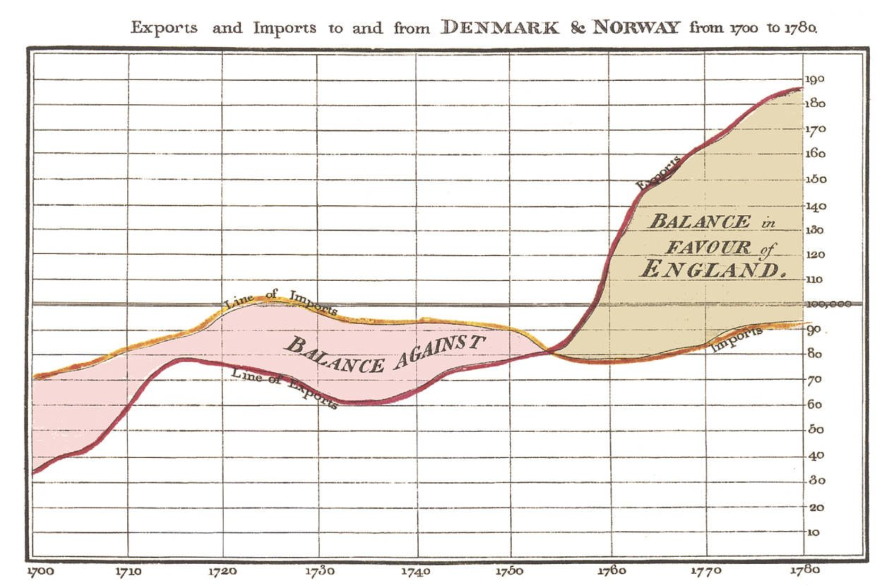{height="500" fig-align="center"}

::: {.aside}
[created: 1786]
:::

## John Snow (1813-1858) {.medium}

::: {.columns}
::: {.column width=60%}
{height="450" style="border: 1px solid;"}
:::

::: {.column width=35%}
{height="450" style="border: 1px solid;"}
:::
:::

::: {.aside}
[created: 1854]
:::

## Charles Joseph Minard (1781-1870) {.medium}

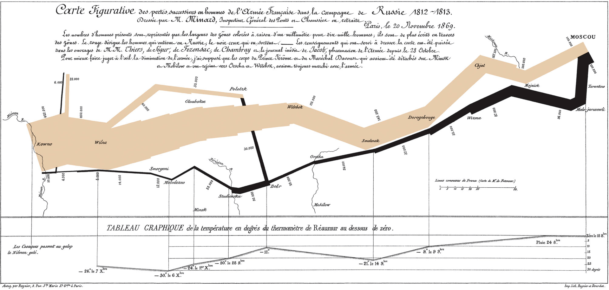{fig-align="center"}

::: {.aside}
[created: 1869]
:::

## W.E.B. Du Bois (1868-1963) {.medium}

::: {.columns}
::: {.column}
{height="500" style="border: 1px solid;"}
:::

::: {.column}
{height="500" style="border: 1px solid;"}
:::
:::

::: {.aside}
[created: 1890]
:::

## Otto Neurath (1882-1945) {.medium}

{height="500" fig-align="center"}

::: {.aside}
[created: 1943]
:::

# Five guidelines for better visualization

<center>
{width=250}
</center>

::: footer
:::

## 1. Choose the adequate type of graph {.medium}

::: {.columns}
::: {.column width=30%}
[Bad:]{.hl .hl-dred .secfont style="font-size:1.3rem;"}
<div style= "float:right;position:relative;vertical-align:top;">
```{r}
#| echo: false
#| warnings: false
#| results: 'asis'
#| fig.width: 2.2
#| fig.height: 2.4
library(tidyverse)
salesdata <- tribble(
  ~department, ~sales,
  "A",950,
  "B",1350,
  "C",490,
  "D",2000,
  "E",100,
  "F",100
)
salesdata |> ggplot(aes(x=department, y=sales, group=1)) +
geom_point() +
geom_line() +
labs(x=NULL, y=NULL, title = "Travel expenses by department") +
theme_minimal() +
theme(plot.title = element_text(size=10),
plot.title.position = "plot")
```
</div>
<br><br><br><br><br><br><br>
[Good:]{.hl .hl-green .secfont style="font-size:1.3rem;"}
<div style= "float:right;position:relative;vertical-align:top;">
```{r}
#| echo: false
#| results: 'asis'
#| fig.width: 2.2
#| fig.height: 2.4
salesdata |> ggplot(aes(x=department, y=sales)) +
geom_bar(stat="identity", width = 0.6) +
scale_y_continuous(labels = scales::dollar) +
labs(x=NULL, y=NULL, title = "Travel expenses by department") +
theme_minimal() +
theme(plot.title = element_text(size=10),
plot.title.position = "plot",
panel.grid.major.x = element_blank(),
panel.grid.minor.y = element_blank())
```
</div>
:::
::: {.column width=70%}
- Choose a chart type with respect to your data (numeric, categorical, ranking, time series etc.)
- What would you like to show: comparison, distribution, composition, relationship?
- To help you find the adequate type from a myriad of alternatives, you can also take a look at [https://www.data-to-viz.com](https://www.data-to-viz.com) and [https://datavizproject.com](https://datavizproject.com)
:::
:::

## A simple decision tree of chart types {.medium}

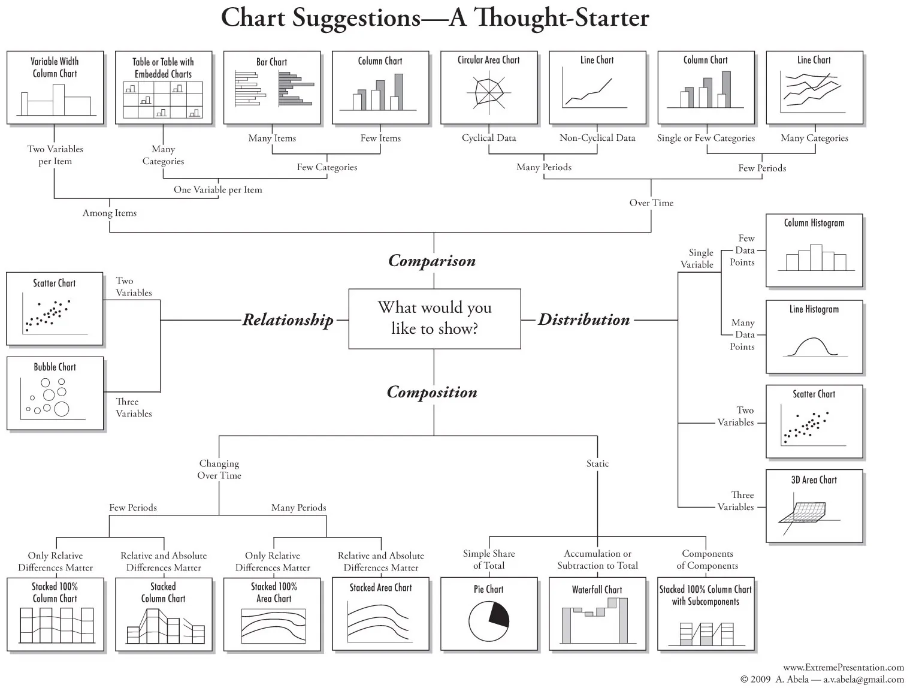{fig-align="center" height="530"}


## 2. Visualize data accurately and faithfully {.medium}

::: {.columns}
::: {.column width=30%}
[Bad:]{.hl .hl-dred .secfont style="font-size:1.3rem;"}
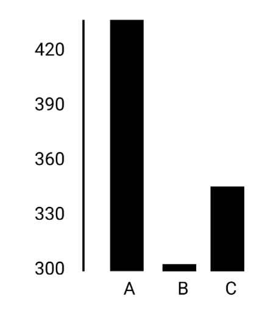{height=230 style="vertical-align:top;"}
<br>
[Good:]{.hl .hl-green .secfont style="font-size:1.3rem;"}
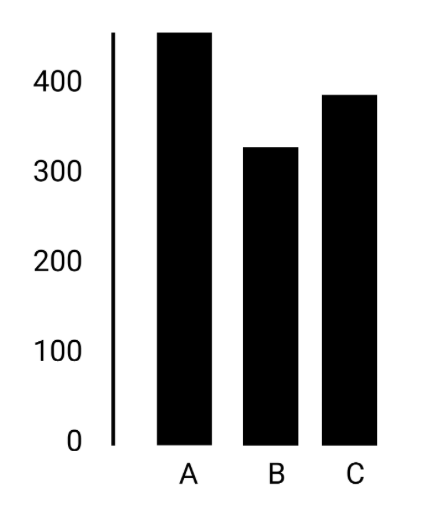{height=230 style="vertical-align:top;"}
:::
::: {.column width=70%}
- Prioritize data accuracy, clarity, and integrity
- Avoid misleading the reader by truncating the y-axis, using two different y-axis, cherry-picking data, not providing context, etc.
- A good story based on data visualization does not involve deceptive manipulation of the data!
:::
:::

::: {.aside}
Source: @dougherty:2021
:::

## Example {.medium}

::: {.columns}
::: {.column}
{height="450" fig-align="center"}
:::
::: {.column .fragment}
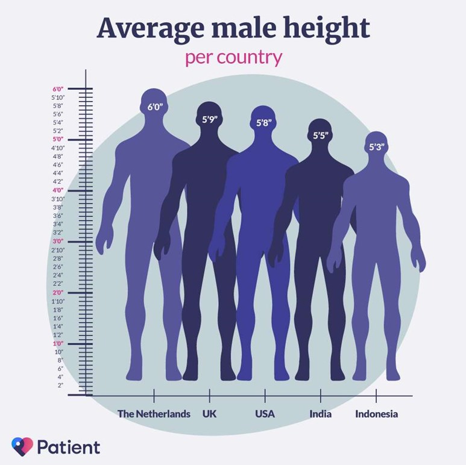{height="450" fig-align="center"}
:::
:::

::: {.aside}
Source: [Patient](https://patient.info/news-and-features/whats-the-average-height-for-men)
:::

## Another example {.medium}

::: {.columns}
::: {.column width=50%}
{height="450"}
:::
::: {.column width=50% .fragment}
<br>
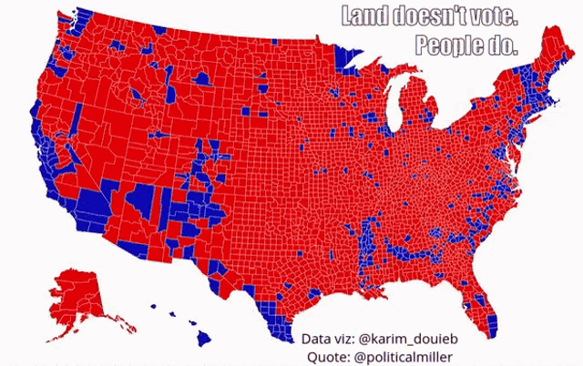{style="border: 1px solid;"}
:::
:::

## A third example {.medium}

::: {.columns}
::: {.column}
{height="450" fig-align="center"}
:::
::: {.column .fragment}
{height="450" fig-align="center"}
:::
:::

::: {.aside}
Source: [The Correspondent](https://thecorrespondent.com/664/how-maps-in-the-media-make-us-more-negative-about-migrants/738023272448-bac255ba)
:::

## 3. Integrate graphics and text {.medium}

::: {.columns}
::: {.column width=30%}
[Bad:]{.hl .hl-dred .secfont style="font-size:1.3rem;"}
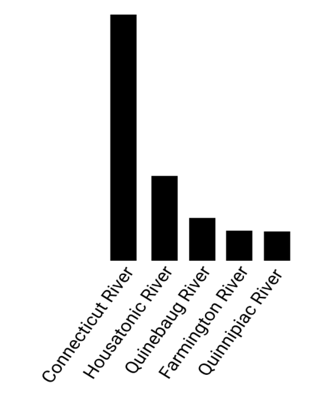{height=250 style="vertical-align:top;"}
<br>
[Good:]{.hl .hl-green .secfont style="font-size:1.3rem;"}
{style="vertical-align:top;"}
:::
::: {.column width=70%}
- Don't make people turn their head to read labels
- Think about a logical order of the chart (alphabetical, values)
- Add direct labels rather than a legend
- Choose a meaningful title that focuses on your message
:::
:::

::: {.aside}
Source: @dougherty:2021
:::

## Best practice {.medium}

::: {.columns}
::: {.column}
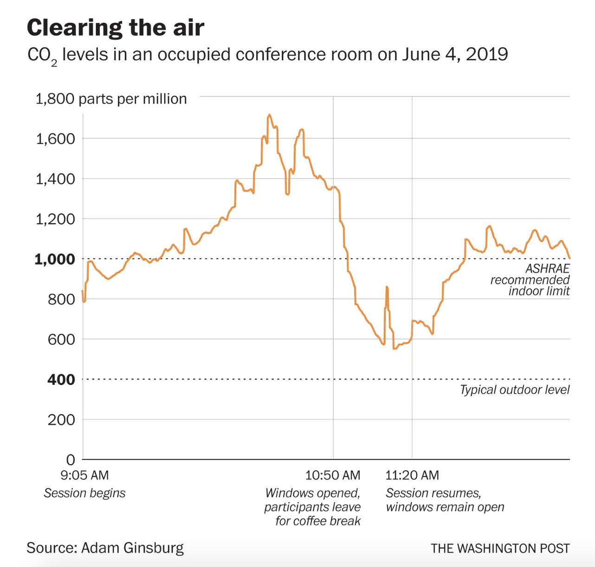
:::
::: {.column .fragment}
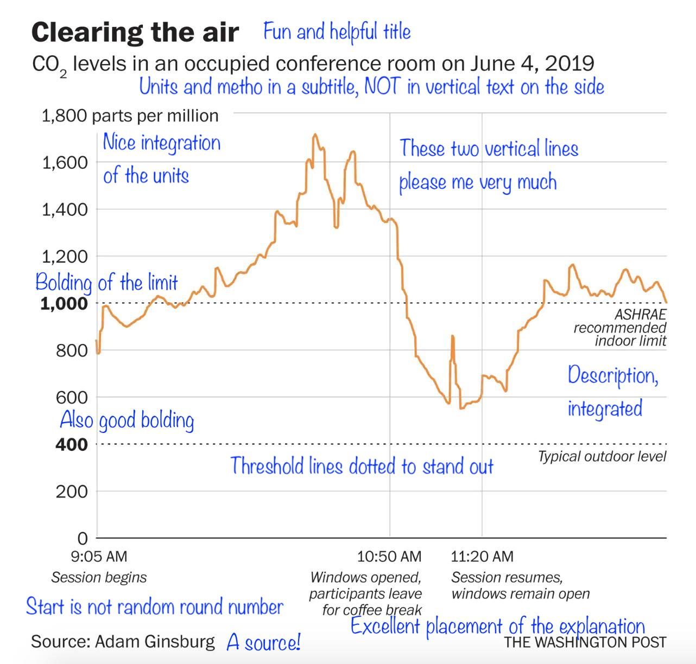
:::
:::

::: {.aside}
Sources: [Washington Post](https://www.washingtonpost.com/business/2019/06/06/why-crowded-meetings-conference-rooms-make-you-so-so-tired/), [chezVoila](https://twitter.com/chezVoila/status/1136631524919513088?s=20)
:::


## 4. Reduce the clutter {.medium}

::: {.columns}
::: {.column width=30%}
[Bad:]{.hl .hl-dred .secfont style="font-size:1.3rem;"}
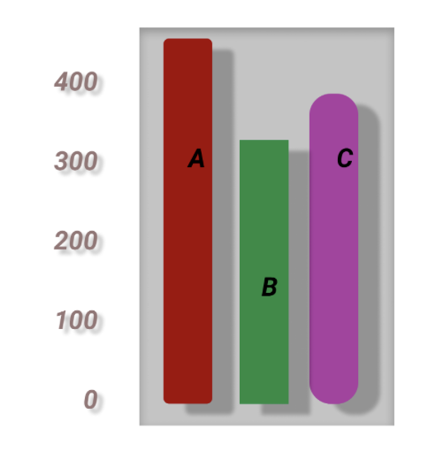{height=230 style="vertical-align:top;"}
<br>
[Good:]{.hl .hl-green .secfont style="font-size:1.3rem;"}
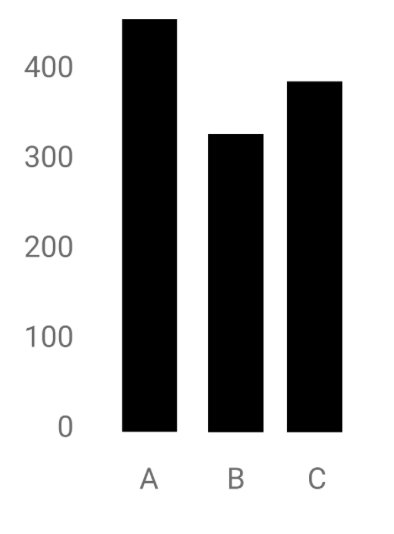{height=230 style="vertical-align:top;"}
:::
::: {.column width=70%}
- Unnecessary visual elements distract the readers from the central data
- Avoid elements that do not contain information!
- Basic elements like heavy tick marks or gridlines should be removed
- Think carefully which visual elements are really needed to read the chart
:::
:::

::: {.aside}
Source: @dougherty:2021
:::

## Best practice {.medium}


::: {.columns}
::: {.column}
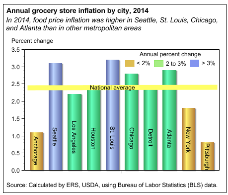
:::
::: {.column .fragment}
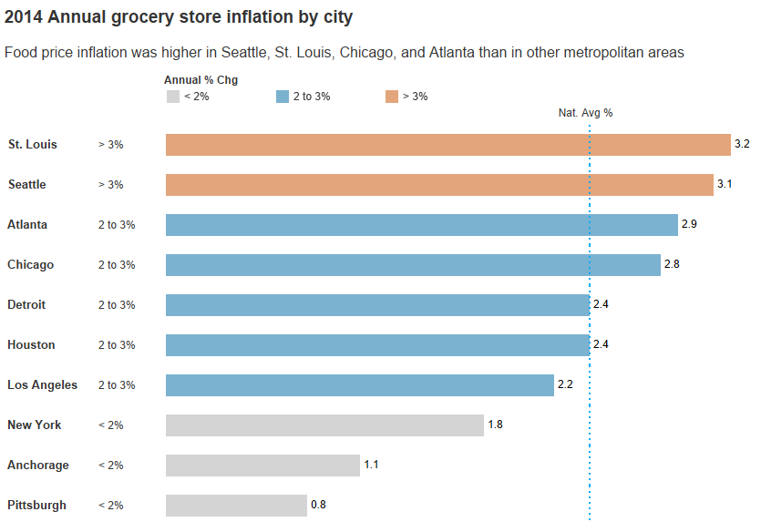{height="400"}
:::
:::

::: {.fragment .absolute top="15%" left="50%"}
```{r clutter}
#| echo: false
#| fig.width: 6
#| fig.height: 5
library(tidyverse)
data <- tribble(~area, ~inflation,
"St. Louis", 3.2,
"Seattle", 3.1,
"Atlanta", 2.9,
"Chicago", 2.8,
"Detroit", 2.4,
"Houston", 2.4,
"Los Angeles", 2.2,
"New York", 1.8,
"Anchorage", 1.1,
"Pittsburgh", 0.8)
data |> ggplot(aes(x = reorder(area, inflation), y = inflation)) +
geom_hline(yintercept = 2.4, linewidth=0.3) +
geom_bar(stat = "identity", width=0.7, aes(fill = inflation > 2.4)) +
annotate("text",y=2.45,x=1, label="National\nAverage: 2.4%", hjust = 0, family="Roboto", size=3) +
geom_text(aes(y = 0.05, label = paste0(inflation,"%")), size = 3, family = "Roboto", hjust=0, color="white", fontface="bold") +
scale_fill_manual(values = c(MetBrewer::met.brewer("Lakota")[c(1,3)])) +
coord_flip() +
labs(x = NULL, y = NULL,
title = "Highest food price inflation in St. Louis and Seattle",
subtitle = "Annual grocery store inflation, 2014") +
theme_minimal() +
theme(panel.grid = element_blank(),
axis.text.y = element_text(family="Roboto", face="bold",size=10),
axis.text.x = element_blank(),
legend.position="none",
plot.title = element_text(family="Roboto", face="bold"),
plot.subtitle = element_text(family="Roboto"),
plot.title.position = "plot")
```
:::

::: {.aside}
Sources: [BlueGranite](https://www.bluegranite.com/blog/data-visualization-remove-chart-clutter-and-focus-on-the-insights)
:::


## 5. Avoid the spaghetti chart and start with gray {.medium}

::: {.columns}
::: {.column width=30%}
[Bad:]{.hl .hl-dred .secfont style="font-size:1.3rem;"}
<div style= "float:right;position:relative;vertical-align:top;">
```{r}
#| echo: false
#| results: 'asis'
#| fig.width: 2.3
#| fig.height: 2.4
set.seed(10)
simdat <- tibble(name=LETTERS[1:15], `2000`=sample(1:20,15), `2010`=sample(1:20,15), `2020`=sample(1:20,15)) |> pivot_longer(-name, names_to="years",values_to="value")
simdat |>
  ggplot(aes(x=years, y=value, group=name, color=name)) +
  geom_line() +
  geom_text(aes(label=name), hjust=-0.3, data = simdat |> filter(years==2020), size = 2.5) +
  scale_x_discrete(expand = c(0.07,0)) +
  labs(x = NULL, y = NULL) +
  theme_minimal() +
  theme(legend.position = "none")
```
</div>
<br><br><br><br><br><br><br>
[Good:]{.hl .hl-green .secfont style="font-size:1.3rem;"}
<div style= "float:right;position:relative;vertical-align:top;">
```{r}
#| echo: false
#| results: 'asis'
#| fig.width: 2.2
#| fig.height: 2.4
simdat |>
  ggplot(aes(x=years, y=value, group=name, color = name)) +
  geom_line(size = 0.3) +
  geom_line(data = simdat |> filter(name %in% c("A","O")), size = 1.2) +
  geom_text(aes(label=name), hjust=-0.3, data = simdat |> filter(years==2020), size = 2.5) +
  scale_color_manual(values = c("red", rep("gray80",13), "olivedrab")) +
  scale_x_discrete(expand = c(0.07,0)) +
  labs(x = NULL, y = NULL) +
  theme_minimal() +
  theme(legend.position = "none",
  panel.grid.minor.y = element_blank())
```
</div>
:::
::: {.column width=70%}
- When the graph contains too much information, it looks like spaghetti
- Try to break overloaded single charts into smaller parts (facets, small multiples) or highlight the relevant information
- Start with gray: you are forced to be strategic in the use of color, labels, etc.
:::
:::


## Best practice {.medium}

::: {.columns}
::: {.column}

:::
::: {.column .fragment}

:::
:::

::: {.aside}
Source: @schwabish:2014
:::

## Deceptive graphs {.medium}

::: {.columns}
::: {.column}
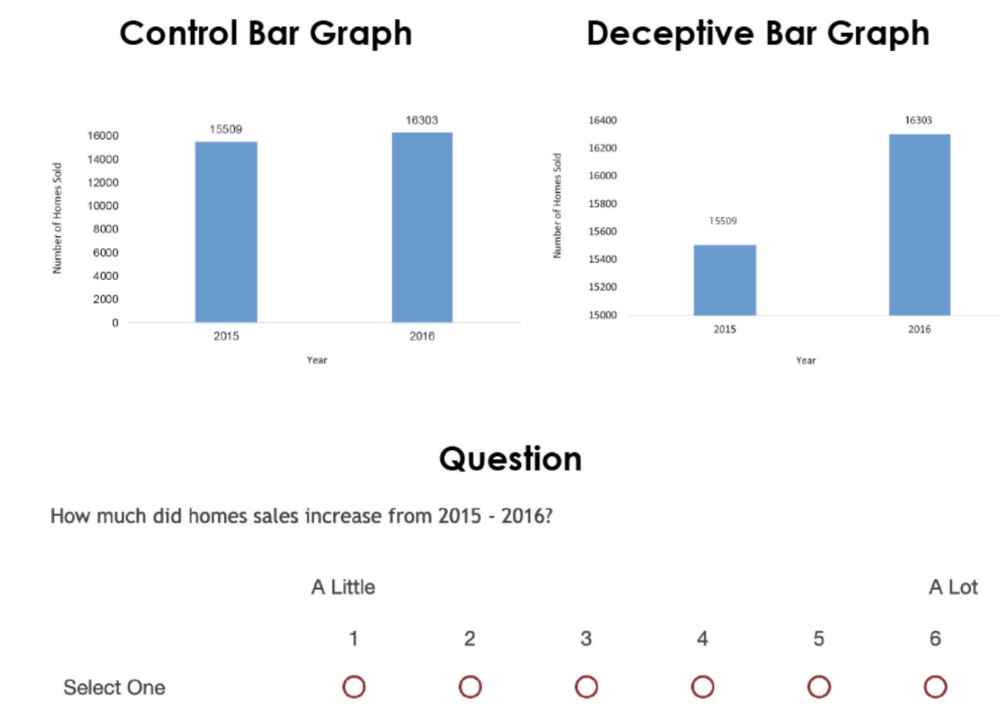
:::
::: {.column}
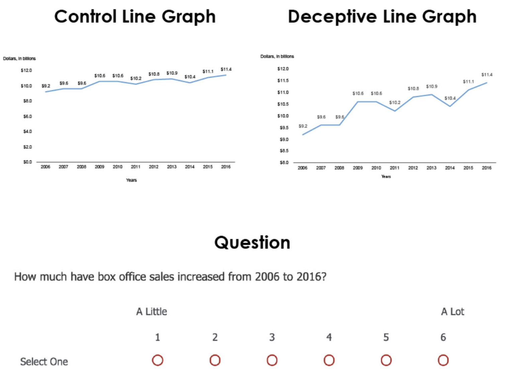
:::
:::

::: {.aside}
Quelle: @lauer:2020
:::

## Deceptive graphs {.medium}

::: {.columns}
::: {.column}
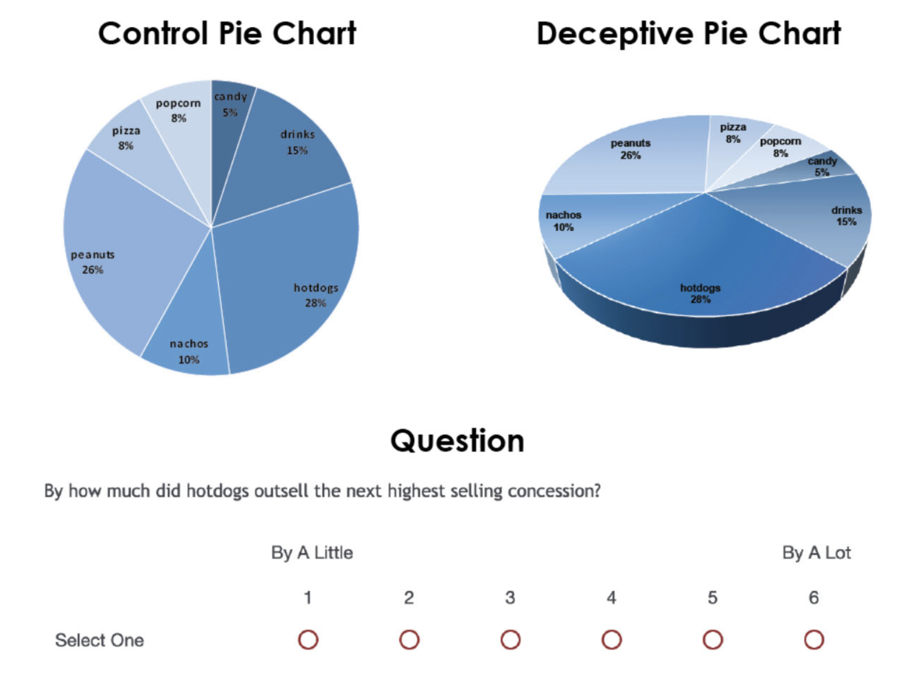
:::
::: {.column}
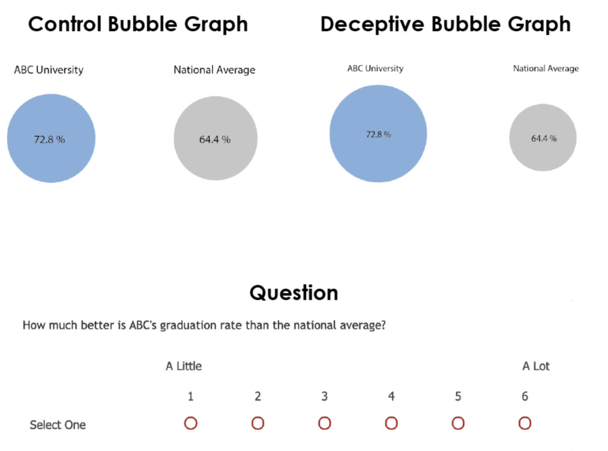
:::
:::

::: {.aside}
Quelle: @lauer:2020
:::


## Misleading titles {.medium}

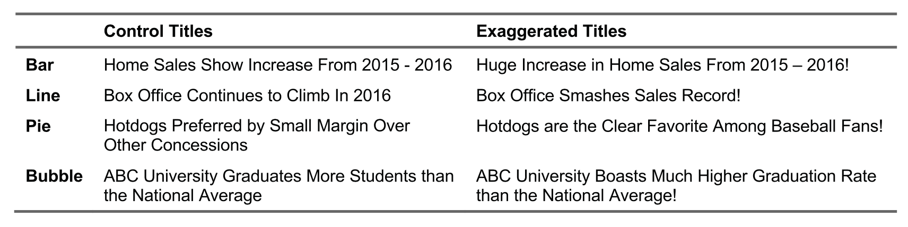

::: {.aside}
Quelle: @lauer:2020
:::

## Deceptive graphs meet their goal {.medium}

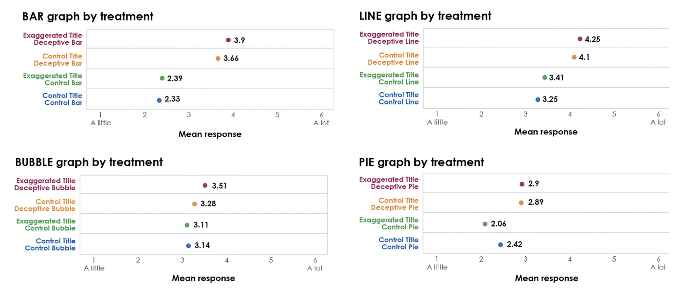

::: {.aside}
Quelle: @lauer:2020
:::


# The Gestalt Principles

<center>
{width=250}
</center>

::: footer
:::

## What are the Gestalt Principles? {.smaller}

Gestalt Principles describe how humans group similar elements, recognize patterns and simplify complex images. "Gestalt" is German for "unified whole". 

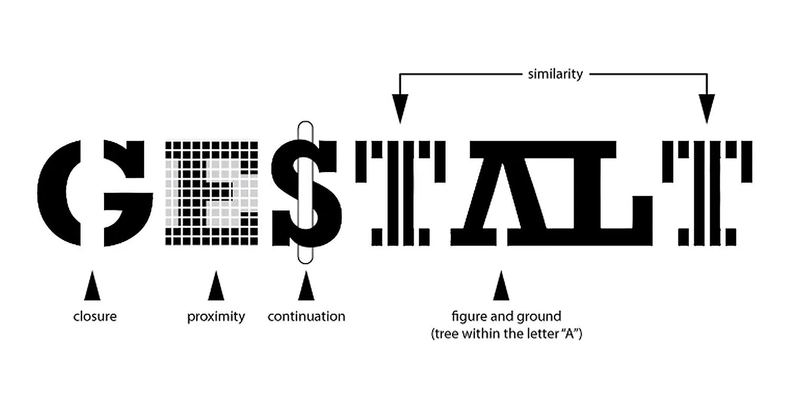{height="250" fig-align="center"}

The question is how humans typically gain meaningful perceptions from the chaotic stimuli around them. The idea is that the mind "informs" what the eye sees by perceiving a series of individual elements as a whole.

## Which chart is random and which has structure in it? {.medium}

::: {.columns}
::: {.column}
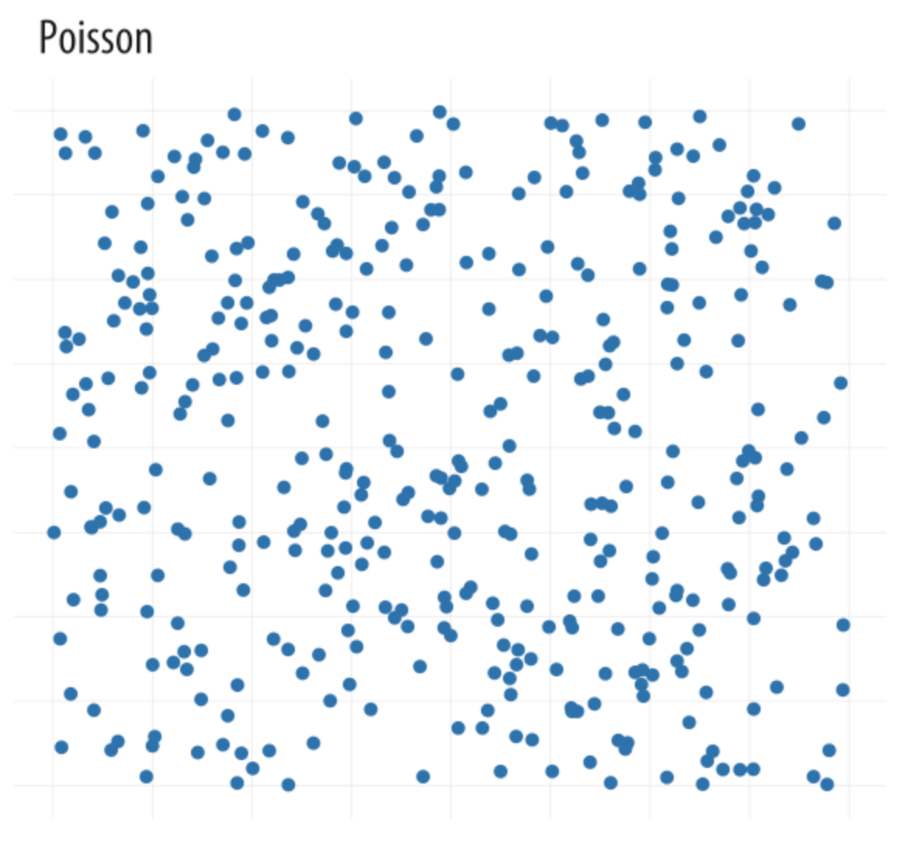
:::
::: {.column}
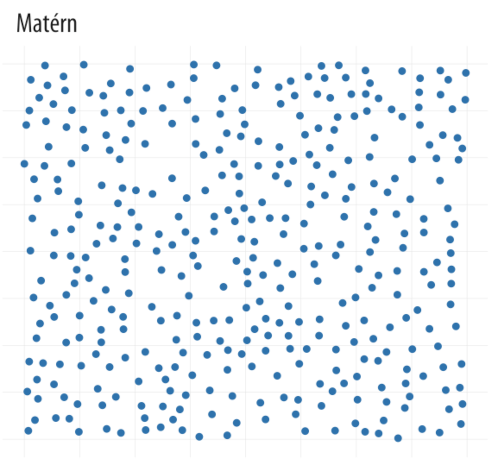
:::
:::

::: {.aside}
Source: @healy:2018
:::

## Gestalt rules {.smaller}

- [Proximity]{.hl .hl-dred .secfont} Things that are spatially near to one another seem to be related.
- [Similarity]{.hl .hl-blue .secfont} Things that look alike seem to be related.
- [Connection]{.hl .hl-dred .secfont} Things that are visually tied to one another seem to be related.
- [Continuity]{.hl .hl-blue .secfont} Partially hidden objects are completed into familiar shapes.
- [Closure]{.hl .hl-dred .secfont} Incomplete shapes are perceived as complete.
- [Figure and Ground]{.hl .hl-blue .secfont} Visual elements are taken to be either in the foreground or the background.
- [Common Fate]{.hl .hl-dred .secfont} Elements sharing a direction of movement are perceived as a unit.

::: {.aside}
Source: @healy:2018
:::

## Our brains look for structure {.medium}

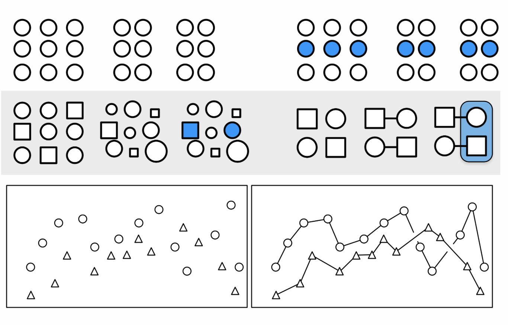{fig-align="center" height=500}

::: {.aside}
Source: @healy:2018
:::


## Bibliography {.bibstyle}

:::footer
:::