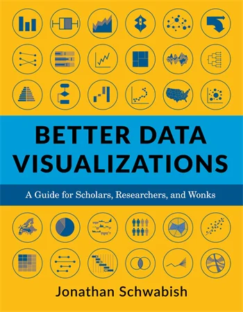
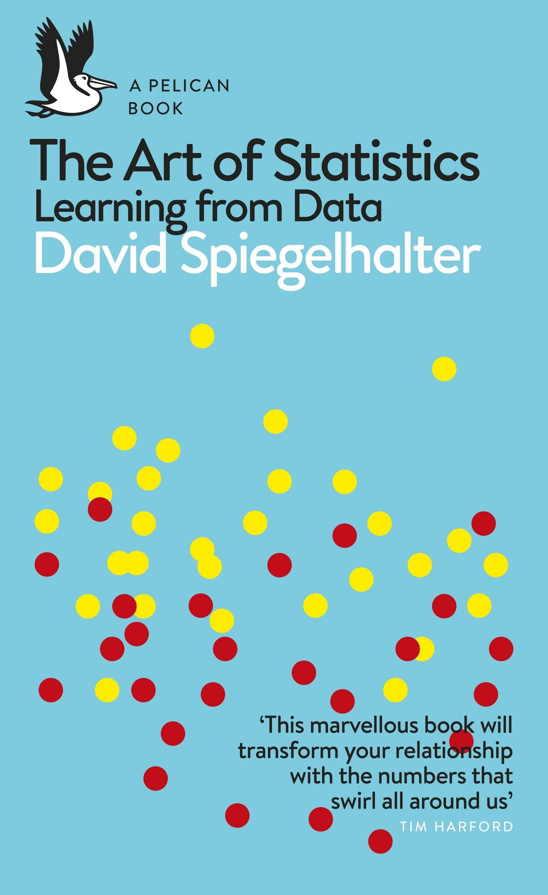

::: {.grid .course-info .course-info-syllabus}

::: {.g-col-12 .g-col-sm-6 .g-col-md-4}
#### Dates

-  &nbsp; 
-  &nbsp; 
-  &nbsp; 
-  &nbsp; 
:::

::: {.g-col-12 .g-col-sm-6 .g-col-md-4}
#### Highlights

-  &nbsp; max.  students
-  &nbsp; Engage in policy discussion
-  &nbsp;&nbsp; Improve your R coding skills
-  &nbsp; Create an own data visualization
:::

::: {.g-col-12 .g-col-sm-6 .g-col-md-4}
#### Contact


:::

:::

#### Course design

The lecturers introduce into various fields of monetary policy and provide examples of data visualizations that serve as starting point for discussions. As the graphic illustration of statistical data gains in importance in both the academic and the public discourse, students will learn best practices and gain insights into the visualization of data. Another take-away of the course is to strengthen the knowledge about the power and limitations of the underlying data of empirical economic policy. A part of each session is dedicated to the work with data. The lecturer provides R-code to produce figures in class. 

Students are expected to recreate three charts at home during the semester and create a comprehensive data visualization with exclusive data from the Austrian National Bank. Students will present their chart in class and draft a report with a detailed description of the data, the code and the final visualization in RMarkdown. Moreover, the best charts are awarded in a joint ceremony with the Austrian National Bank.

The sessions are designed to encourage students to actively participate in the debates, raise questions, and gain experience in visualizing data for academic publications or the general debate.

#### Recommended literature

::: {.recommended-lit }
|   |   |
|--------|--------|
|  | **Jonathan Schwabish**   *Better Data Visualizations: A Guide for Scholars, Researchers, and Wonks*   Columbia University Press   ISBN-13: 9780231193115   [Link](https://cup.columbia.edu/book/better-data-visualizations/9780231193115) |
|  | **David Spiegelhalter**   *The Art of Statistics: Learning from Data*   Penguin Books UK   ISBN-13: 9780241258767   [Link](https://www.penguin.co.uk/books/294857/the-art-of-statistics-by-spiegelhalter-david/9780241258767) |
: {tbl-colwidths="[15,85]"}
:::

#### Learning outcomes

After completing this course, students will:

- know key figures in various fields of monetary policy
- be aware of potentials and limitations of available data in specific policy areas
- show improved programming skills in R and the ability to create an RMarkdown report
- have basic knowledge of important principles of data visualization
- be able to create simple charts to enrich their academic articles

#### Grading

::: { .grading }
 | 
-|---------------------------------------------
  | Assignments: 30\% (0-10 points for each visualization) 
   | Chart presentation: 30\% (0-20 points for the quality of the presentation, 0-10 for the preliminary chart) 
   | Written report: 40\% (0-40 points for the report and the final chart) 
:::

 &nbsp; 100-90: Excellent &emsp;
 &nbsp; 89-80: Good &emsp;
 &nbsp; 79-65: Satisfactory &emsp;
 &nbsp; 64-50: Sufficient

**All single tasks have to be passed** (50\% threshold each).