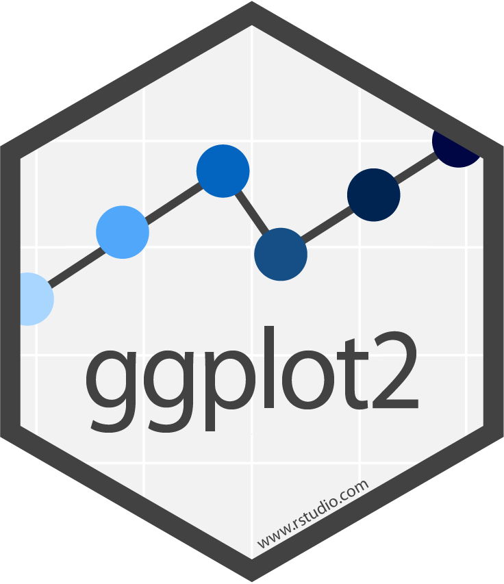
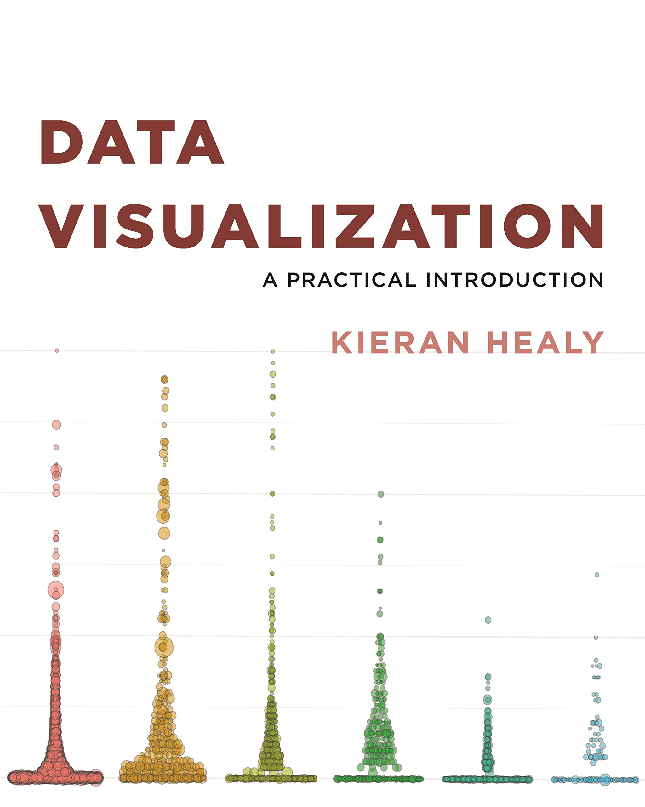
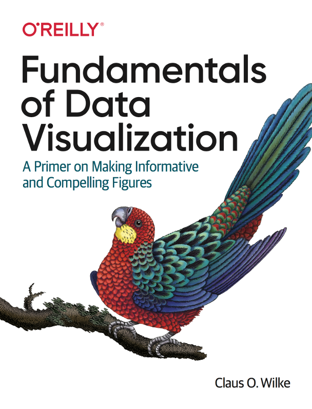
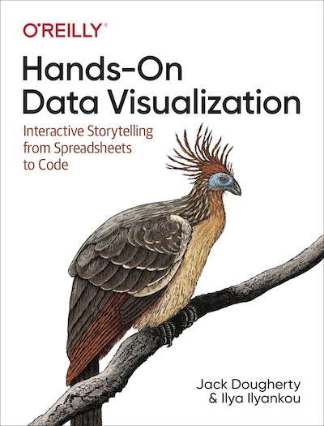

#### Data visualization

Students will create a preliminary chart addressing a relevant problem of economic policy for an in-class presentation. The presentation should provide an intuition of the research question, the underlying data of the chart and considerations behind the style of the chart. **The time slot for the presentation is five minutes.** Afterwards we will have a brief Q&A in class. The presentation should only have a small number of slides with little text to lead the audience through the process of chart creation, e.g.

- *Research question*: Which issue in economic policy do you want to address with your chart? 
- *Data*: What data did you use?
- *Chart*: What does the chart show? What were your thoughts when choosing this style?
- *Conclusion*: What can we learn from this data visualization for economic policy?

#### RMarkdown report

Students are required to draft a short report around the chart, containing the economic policy background and the most important information about chart creation. **The final version of the report is due on January 31, 2027.** You should work with [RMarkdown](https://rmarkdown.rstudio.com/index.html) (or [Quarto](https://quarto.org)) which is a handy and simple tool to compose reports based on R code. It is recommended to edit the document in [RStudio](https://posit.co) and compile it in HTML format. The final report should be structured as follows:

- *Introduction:* Explain why the topic you chose is important and interesting for the academic/public debate.
- *Research question:* What is the specific research question that you want to address with your visualization?
- *Data:* What data did you use? What are the limitations of the data? If helpful, you might want to include some descriptive statistics as a table.
- *Result:* Present and describe the chart that you have created.
- *Conclusion*: What are the policy conclusions of your chart? 
- *Code:* Provide the full code for your data visualization as a code block in the appendix of the report.

#### Cheatsheets

[{width=120}](data/cheatsheets/tidyr.pdf) [{width=120}](data/cheatsheets/dplyr.pdf) [{width=120}](data/cheatsheets/ggplot.pdf) [{width=120}](data/cheatsheets/rmarkdown.pdf)

#### Additional online resources

::: {.recommended-lit }
|   |   |
|--------|--------|
| {style="border: 0.5px solid black"} | **Kieran Healy**   *Data Visualization: A Practical Introduction*   Princeton University Press   ISBN-13: 9780691181622   [Link](https://socviz.co/index.html#preface) |
| {style="border: 0.5px solid black"} | **Claus O. Wilke**   *Fundamentals of Data Visualization: A Primer on Making Informative and Compelling Figures*   O'Reilly Media   ISBN-13: 9781492031086   [Link](https://clauswilke.com/dataviz/) |
| {style="border: 0.5px solid black"} | **Jack Dougherty and Ilya Ilyankou**   *Hands-On Data Visualization: Interactive Storytelling from Spreadsheets to Code*   O'Reilly Media   ISBN-13: 9781492086000   [Link](https://handsondataviz.org) |
: {tbl-colwidths="[15,85]"}
:::